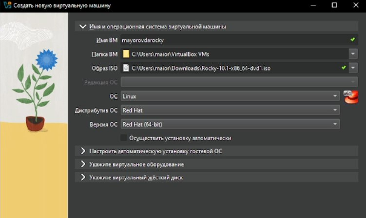
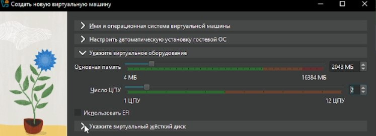
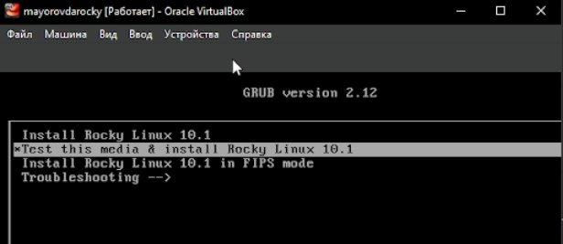
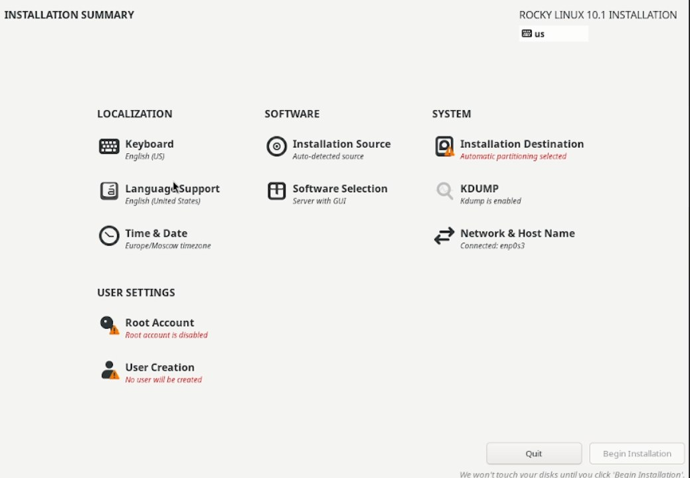
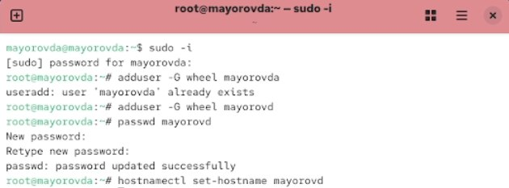
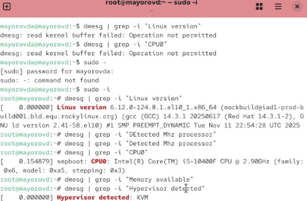

---
## Author
author:
  name: Майоров Дмитрий Андреевич

## Title
title: Установка и конфигурация операционной системы на виртуальную машину
date: today
date-format: "YYYY-MM-DD" # Example: 2025-11-29
---

## Докладчик

:::::::::::::: {.columns align=center}
::: {.column width="70%"}

  * Майоров Дмитрий Андреевич

:::
::: {.column width="30%"}

:::
::::::::::::::

# Содержание

1 Цель работы
2 Ход выполнения лабораторной работы
3 Выводы

# Цель работы

Приобретение навыков установки и конфигурации операционной системы на виртуальную машину

# Ход выполнения лабораторной работы 

Первым делом создаем виртуальную машину, даем ей название, выбираем образ диска, настраиваем оперативную память, количество процессоров и обьем виртуального жесткого диска

# Ход выполнения лабораторной работы

# Ход выполнения лабораторной работы

# Ход выполнения лабораторной работы

Далее в настройках выбираем «USB планшет» в пунтке «Манипулятор курсосра» для корретного автозахвата мыши

# Ход выполнения лабораторной работы

Далее выбираем пункт «Install Rocky Linux version 10.1» для установки образа ОС

# Ход выполнения лабораторной работы

Далее переходим к настройках установки ОС

# Ход выполнения лабораторной работы

Ждем устновку ОС

# Ход выполнения лабораторной работы

Далее устанавливаем имя пользователя и название хоста

# Домашнее задание

С помощью команды dmesg смотрим информацию о версии ядра, модели процессора и тд

# Выводы

Приобретены навыки установки и конфигурации операционной системы на виртуальную машину

:::
