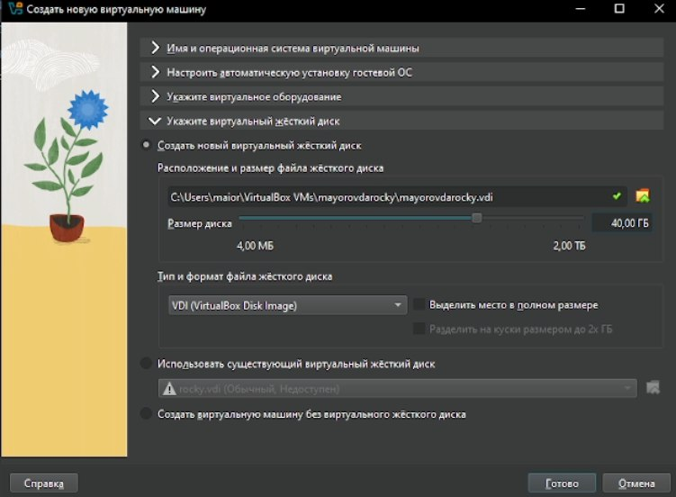
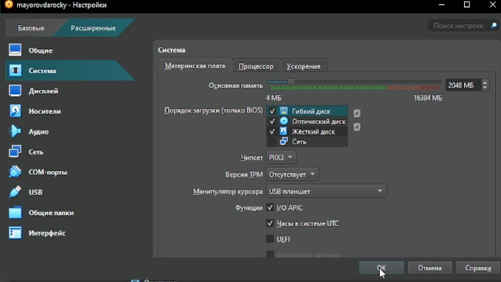
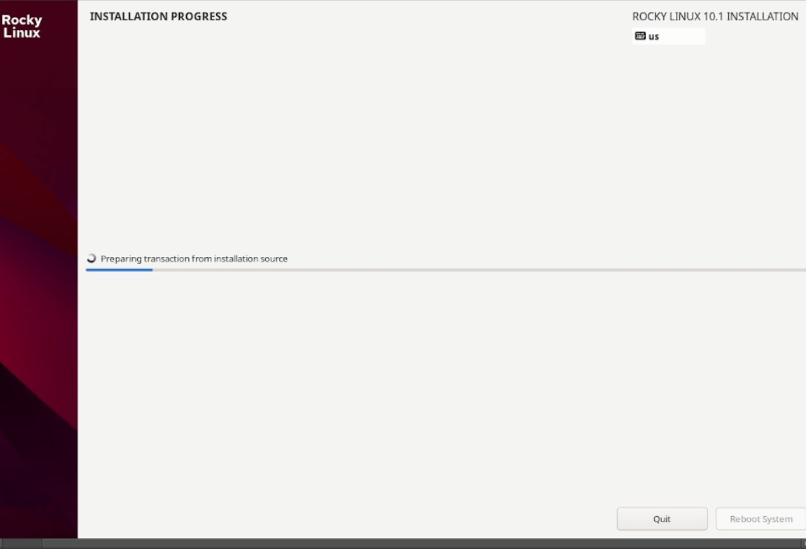

---
## Author
author:
  name: Майоров Дмитрий Андреевич
  degrees: DSc
  orcid: 0000-0002-0877-7063

## Title
title: "Установка и конфигурация операционной системы на виртуальную машину"
license: "CC BY"
---

# Цель работы

Приобретение навыков установки и конфигурации операционной системы на виртуальную машину

# Ход выполнения лабораторной работы

Первым делом создаем виртуальную машину, даем ей название, выбираем образ диска, настраиваем оперативную память, количество процессоров и обьем виртуального жесткого диска

{#fig-001 width=70%}

{#fig-001 width=70%}

{#fig-001 width=70%}

Далее в настройках выбираем "USB планшет" в пунтке "Манипулятор курсосра" для корретного автозахвата мыши 

{#fig-001 width=70%}

Далее выбираем пункт "Install Rocky Linux version 10.1" для установки образа ОС

{#fig-001 width=70%}

Далее переходим к настройках установки ОС

{#fig-001 width=70%}

Ждем устновку ОС

{#fig-001 width=70%}

Далее устанавливаем имя пользователя и название хоста

{#fig-001 width=70%}

Переходим к домашнему заданию. С помощью команды dmesg смотрим информацию о версии ядра, модели процессора и тд

{#fig-001 width=70%}

# Выводы

Приобретены навыки установки и конфигурации операционной системы на виртуальную машину

