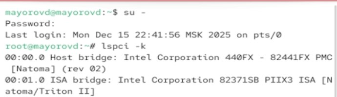
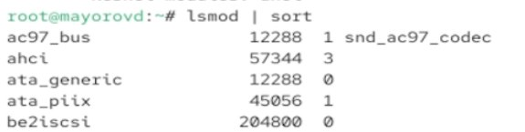
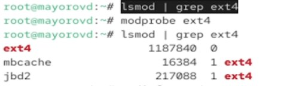
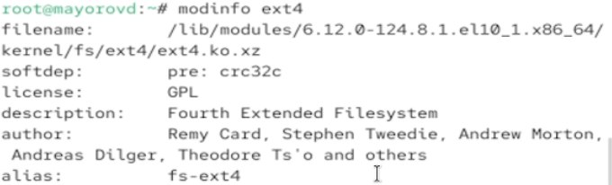
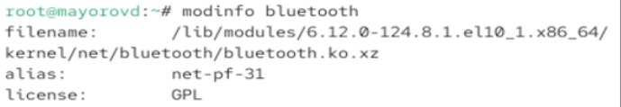
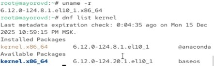
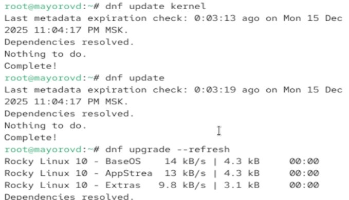
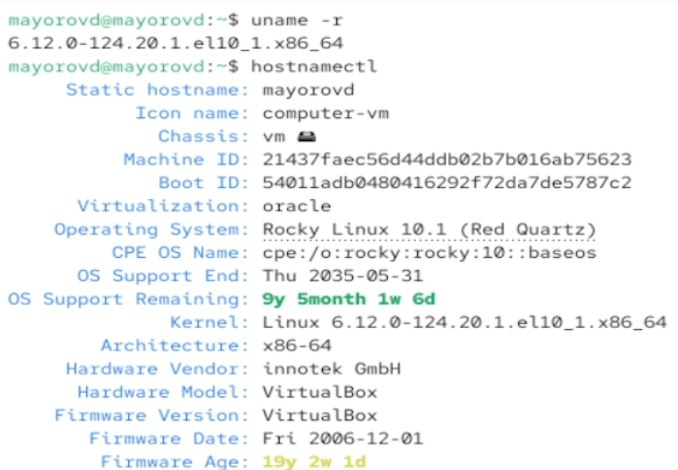

---
## Author
author:
  name: Майоров Дмитрий Андреевич

## Title
title: "Основы работы с модулями ядра операционной системы"

---

# Цель работы

Получить навыки работы с утилитами управления модулями ядра операционной системы

# Выполнение лабораторной работы

Открываем терминал, получаем полномочия администратора. Смотрим, какие устройства имеются в системе и какие модули ядра с ними связанаы. Команда lsipci -k выводит список всех PCI-устройств в системе с указанием драйверов и модулей ядра, которые с ними работают

{#fig-001 width=70%}

Смотрим какие модули ядра загружены

{#fig-001 width=70%}

Смотрим, загружен ли модуль ext4, загружаем его и убеждаемся, что он загружен

{#fig-001 width=70%}

Смотрим информацию о модуле ядра ext4. Команда выводит путь к файлу модуляв системе, указывает на зависимость модуля(pre: crc32c), отображает лицензию модуля, краоткое описание пмодуля, авторов модуля и псевдонимы, под которыми система может ссылать на этот модуль

{#fig-001 width=70%}

Выгружаем модуль ext4

{#fig-001 width=70%}

Выгружаем модуль ядра xfs, получаем сообщение об ошибке, так как модуль ядра в данный момент используется

{#fig-001 width=70%}

Смотрим загружен ли модуль bluetooth, загружаем его и просматриваем список модулей ядра, отвечающих за работу с bluetooth

{#fig-001 width=70%}

Смотрим информацию о модуле bluetooth. Для того чтобы посмотреть, какие параметры могут быть установлены для этого модуля, можно использовать команду modinfo bluetooth | grep parm. Существуют такие параметры, как disable_esco, disable_ertm, enable_hs и другие. Далее выгружаем модуль ядра bluetooth.

{#fig-001 width=70%}

{#fig-001 width=70%}

Смотрим, какая версия ядра используется в ОС. Выводим на экран список пакетов, относящихся к ядру ОС

{#fig-001 width=70%}

Обновляем систему, чтобы убедиться, что все существующие пакеты обновлены

{#fig-001 width=70%}

Обновляем ядро ОС, а затем саму ОС. Перезагружаем систему

{#fig-001 width=70%}

Смотрим версию ядра, которая используется в ОС

{#fig-001 width=70%}

# Выводы

Мы получили навыки работы с утилитами управления модулями ядра операционной системы
