---
## Author
author:
  name: Майоров Дмитрий Андреевич

## Title
title: Управление загрузкой системы

---

# Информация

## Докладчик

:::::::::::::: {.columns align=center}
::: {.column width="70%"}

  * Майоров Дмитрий Андреевич

:::
::::::::::::::

# Цель работы

Получить навыки работы с загрузчиком системы GRUB2.

# Выполнение лабораторной работы

Запускаем терминал, получаем полномочия администратора. В файле /etc/default/grub устанавливаем параметр GRUB_TIMEOUT=10. Далее записываем изменения в GRUB2 c помощью следующей команды

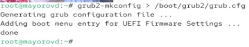{#fig-001 width=70%}

# Выполнение лабораторной работы

Перезагружаем систему. В меню GRUB выбираем строку с текущей версией ядра и открываем редактирование. В нужной строке вводим следующую команду и удаляем опции rhgb и quit.

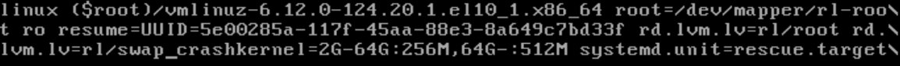{#fig-001 width=70%}

# Выполнение лабораторной работы

Смотрим список всех файлов модулей загруженных в настоящее время

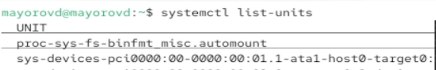{#fig-001 width=70%}

# Выполнение лабораторной работы

Смотрим задействованные переменные среды оболочки

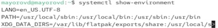{#fig-001 width=70%}

# Выполнение лабораторной работы

Перезагружаем систему. В меню GRUB выбираем строку с текущей версией ядра и открываем редактирование. В нужной строке вводим следующую команду и удаляем опции rhgb и quit.

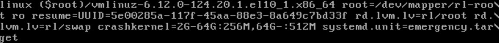{#fig-001 width=70%}

# Выполнение лабораторной работы

Смотрим список всех файлов модулей загруженных в настоящее время

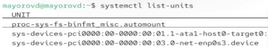{#fig-001 width=70%}

# Выполнение лабораторной работы

Перезагружаем систему. В меню GRUB выбираем строку с текущей версией ядра и открываем редактирование. В нужной строке вводим следующую команду и удаляем опции rhgb и quit.

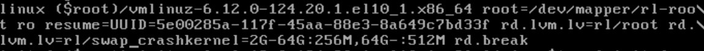{#fig-001 width=70%}

# Выполнение лабораторной работы

Получаем доступ к системному образу для чтения и записи

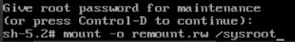{#fig-001 width=70%}

# Выполнение лабораторной работы

Делаем содержимое каталога /sysimage новым корневым каталогом и устанавливаем новый пароль

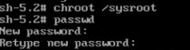{#fig-001 width=70%}

# Выполнение лабораторной работы

Загружаем политику SELinux

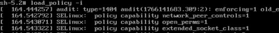{#fig-001 width=70%}

# Выполнение лабораторной работы

Вручную устанавливаем правильный тип контекста для /etc/shadow

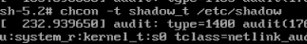{#fig-001 width=70%}

# Выполнение лабораторной работы

Перезагружаем систему и входим под новым паролем

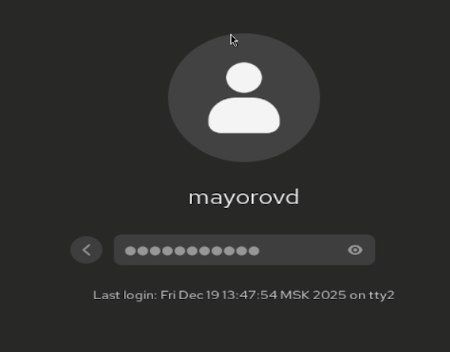{#fig-001 width=70%}

# Выводы

Получены навыки работы с загрузчиком системы GRUB2.

:::

:::
