---
## Author
author:
  name: Майоров Дмитрий Андреевич

## Title
title: "Настройки сети в Linux"

---

# Цель работы

Получить навыки настройки сетевых параметров системы

# Выполнение лабораторной работы 

Получаем полномочия администратора. Выводим на экран информацию о существующих сетевых подключениях, а также статистику о количестве отправленных пакетов и связанных с ними сообщениях об ошибках. Команда выводит основную информацию об интерфейсе(номер интерфейса, его имя, флаги состояния, состояние. Статистику приема и статистику передачи)

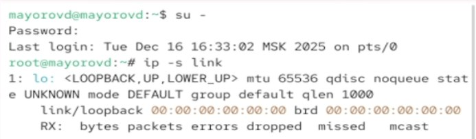{#fig-001 width=70%}

Выводим на экран информацию о текущих маршрутах. Команда выводит маршрут по умолчанию, локальную сеть, другие сети и специальные маршруты

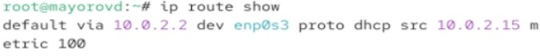{#fig-001 width=70%}

Выводим на экран информацию о текущих назначениях адресов для сетевых интерфейсов на устройстве. Команда выводит общую информацию, MAC-адрес, IPv4 адреса и IPv6 адреса

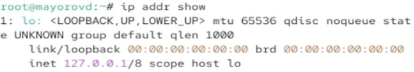{#fig-001 width=70%}

Отправляем 4 пакета на IP-адрес 8.8.8.8

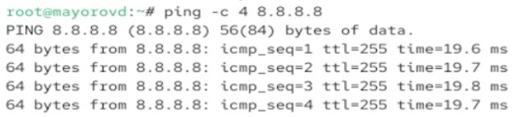{#fig-001 width=70%}

Добавляем дролнительный адрес к интерфейсу. Проверяем что он добавился

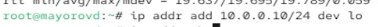{#fig-001 width=70%}

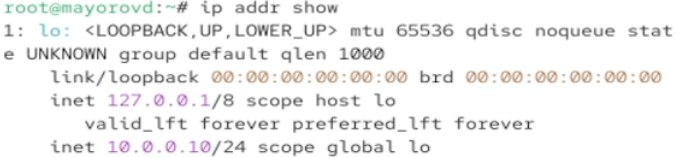{#fig-001 width=70%}

Вводим команду ifconfig. В отличии от утилиты ip эта команда показывает меньше деталей, не показывает некоторые современные флагм и может не показывать все интерфейсы

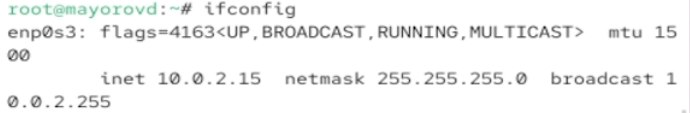{#fig-001 width=70%}

Выводим на экран список всех прослушиваемых системой портов UDP и TCP

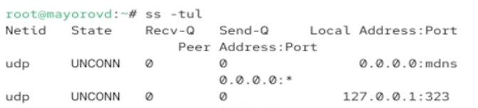{#fig-001 width=70%}

Выводим на экран информацию о текущих соединениях

{#fig-001 width=70%}

Добавляем Ethernet-соединение с именем dhcp к интерфейсу

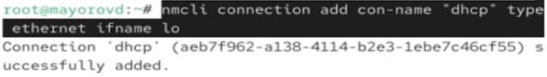{#fig-001 width=70%}

Добавляем к этому же интерфейсу Ethernet-соединение с именем static, статическим IPv4-адресом адаптера и статическим адресом шлюза

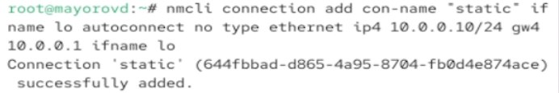{#fig-001 width=70%}

Выводим информацию о текущих соединениях

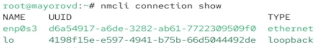{#fig-001 width=70%}

Переключаемся на статическое соединение, проверяем успешность переключения и возвращаемся к соединению dhcp.

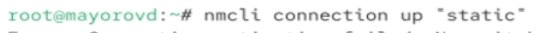{#fig-001 width=70%}

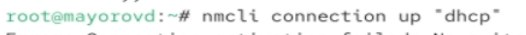{#fig-001 width=70%}

Отключаем автоподключение статического соединения и добавляем DNS-сервер в статическое соединение.

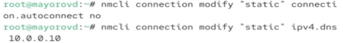{#fig-001 width=70%}

Добавляем еще один DNS-сервер.

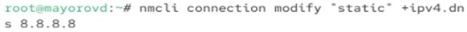{#fig-001 width=70%}

Изменяем IP-адрес статического соединения и доавляем другой IP-адрес

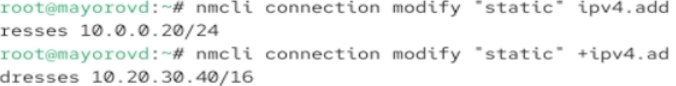{#fig-001 width=70%}

Активируем соединение. Проверяем успешность и переключаемся на первоначальное соедниение

{#fig-001 width=70%}

# Выводы

Получаем навыки настройки сетевых параметров системы

:::
