---
## Author
author:
  name: Майоров Дмитрий Андреевич
## Title
title: Фильтр пакетов

---

# Информация

## Докладчик

:::::::::::::: {.columns align=center}
::: {.column width="70%"}

  * Майоров Дмитрий Андреевич

:::
::: {.column width="30%"}

:::
::::::::::::::

# Цель работы

Получить навыки настройки пакетного фильтра в Linux.

# Выполнение лабораторной работы

Определяем текущую зону по умолчанию. Определяем доступные зоны. Смотрим службы, доступные на нашем компьютере

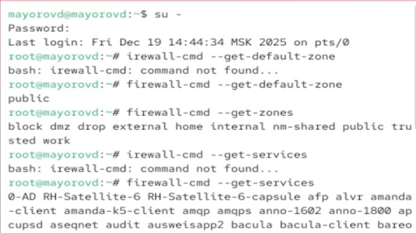{#fig-001 width=70%}

# Выполнение лабораторной работы

Определяем доступные службы в текущей зоне

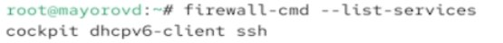{#fig-001 width=70%}

# Выполнение лабораторной работы

Вводим две команды для вывода информации. Первая команда выводит информацию для активной зоны, а вторая тольок для указанной

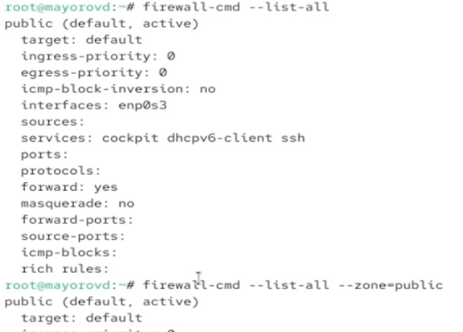{#fig-001 width=70%}

# Выполнение лабораторной работы

Добавляем сервер VNS в конфигурацию брэндмауэра. Проверяем, добавился ли он

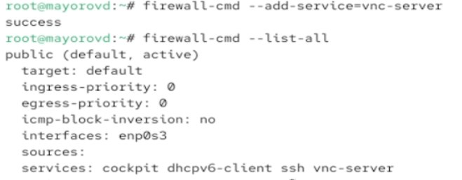{#fig-001 width=70%}

# Выполнение лабораторной работы

Перезапускаем службу firewall. Проверяем есть ли в конфигурации vns-сервер. Его нет, так как он был добавлен временным правилом(без permanent)

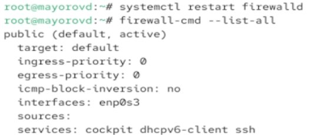{#fig-001 width=70%}

# Выполнение лабораторной работы

Еще раз добавляем сервер, но уже делаем его постоянным. Проверяем, добавился ли он

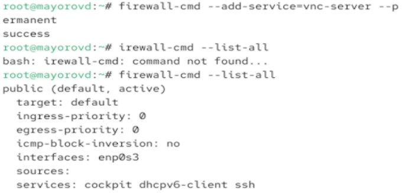{#fig-001 width=70%}

# Выполнение лабораторной работы

Перезагружаем конфигурацию firewalld и смотрим конфигурацию времени выполнения

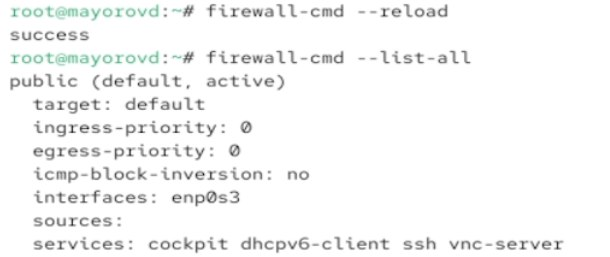{#fig-001 width=70%}

# Выполнение лабораторной работы

Добавляем в конфигурацию межсетевого экрана порт 2022 протокола TCP. Перезагружаем конфигурацию. Проверяем, добавился ли порт

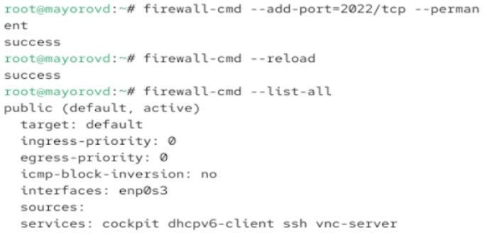{#fig-001 width=70%}

# Выполнение лабораторной работы

Устанавливаем firewall-config.

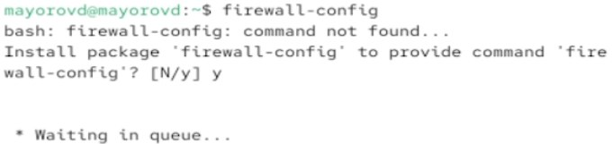{#fig-001 width=70%}

# Выполнение лабораторной работы

Нажимаем выпадающее меню рядом с параметром Configuration . Открываем раскрывающийся список выберираем Permanent. Выбераем зону public и отмечаем службы http, https и ftp, чтобы включить их.

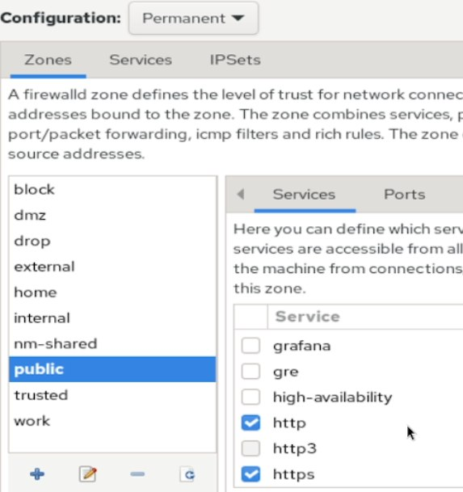{#fig-001 width=70%}

# Выполнение лабораторной работы

Выбераем вкладку Ports и на этой вкладке нажимаем Add . Вводим порт 2022 и протокол udp.

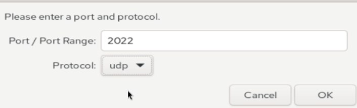{#fig-001 width=70%}

# Выполнение лабораторной работы

Вводим команду firewall-cmd --list-all. 

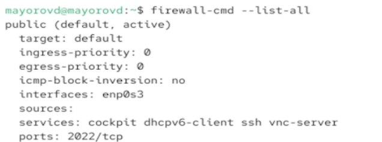{#fig-001 width=70%}

# Выполнение лабораторной работы

Изменения которые мы внесли еще не вступили в силу. Перезагружаем конфигурацию. Снова смотрим список доступных сервисов.

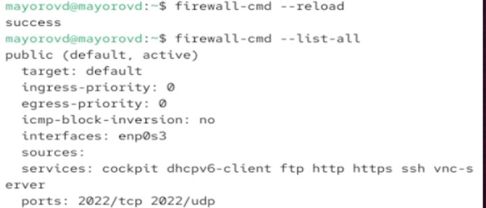{#fig-001 width=70%}

# Выполнение лабораторной работы

Добавляем вручную службу telnet в постоянную конфинурацию

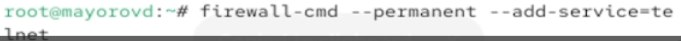{#fig-001 width=70%}

# Выполнение лабораторной работы

В графическом интерфейсе добавляем остальные нужные нам службы

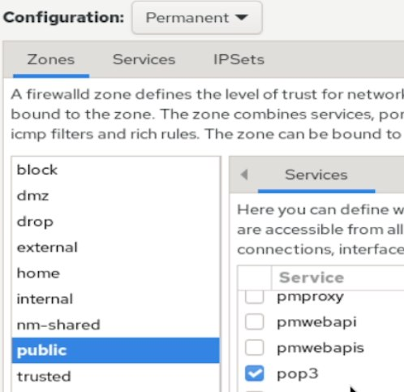{#fig-001 width=70%}

# Выполнение лабораторной работы

Выбераем вкладку Ports и на этой вкладке нажимаем Add . Вводим порт 2022 и протокол udp.

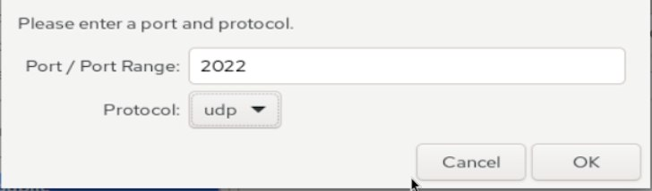{#fig-001 width=70%}

# Выполнение лабораторной работы

Перезагружаем конфигурацию. Смотрим список доступных сервисов.

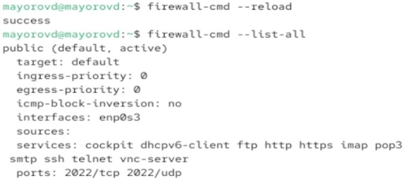{#fig-001 width=70%}

# Выполнение лабораторной работы

# Выводы

Получены навыки настройки пакетного фильтра в Linux.

