---
## Author
author:
  name: Майоров Дмитрий Андреевич

## Title
title: "Партиции, файловые системы, монтирование"

---

# Цель работы

Получить навыки создания разделов на диске и файловых систем. Получить навыки монтирования файловых систем

# Выполнение лабораторной работы

Добавляем к нашей виртуальной машине два диска размером 512МБ

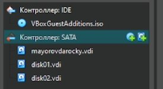{#fig-001 width=70%}

Запускаем ВМ. Получаем полномочия администратора. Смотрим перечень разедлов на всех в системе устройствах жестих дисков

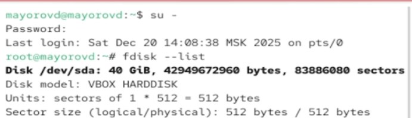{#fig-001 width=70%}

Начинаем делать разметку диска

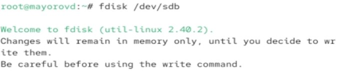{#fig-001 width=70%}

Делаем разметку диска с помощью различных команд

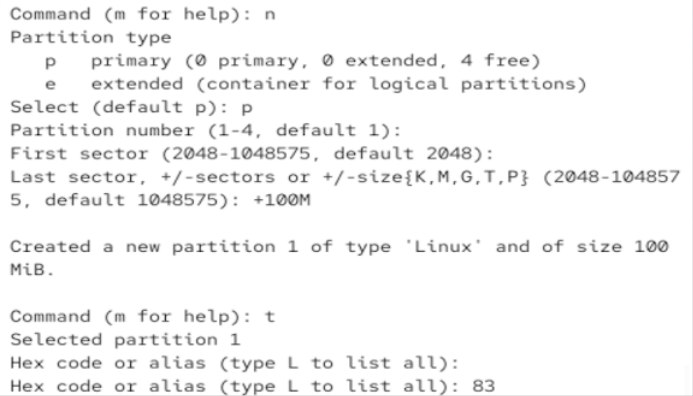{#fig-001 width=70%}

Вводим две команды. Первая нужна для детального анализа разделов. Вторая для быстрого списка устройств на уровне ядра

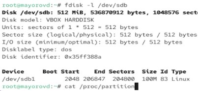{#fig-001 width=70%}

Записываем изменения в таблицу разделов ядра

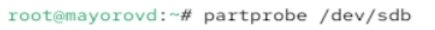{#fig-001 width=70%}

Снова работаем с разметкой диска. Создаем расширенный раздел

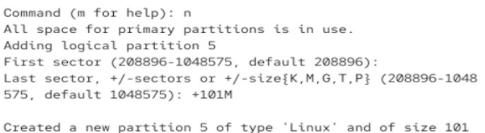{#fig-001 width=70%}

Записываем изменения в таблицу разделов ядра

{#fig-001 width=70%}

Смотрим информацию о добавленных разделах

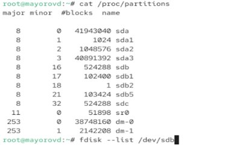{#fig-001 width=70%}

Снова работаем с разметкой диска. ВЫбираем новый тип раздела

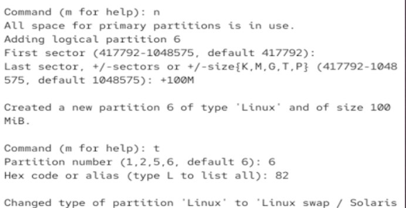{#fig-001 width=70%}

Записываем изменения в таблицу разделов ядра и смотрим информацию о добавленных разделах

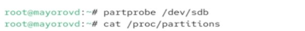{#fig-001 width=70%}

Форматируем раздел прокачки. Включаем вновь выделенное пространство и просматриваем размер пространства прокачки, которое выделено в настоящий момент

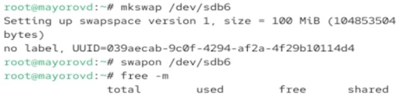{#fig-001 width=70%}

Смотрим таблицы разделов и разделы на втором добавленном нами диске

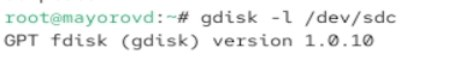{#fig-001 width=70%}

Создаем раздел

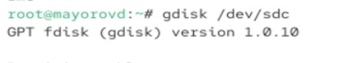{#fig-001 width=70%}

Работаем с разметкой диска

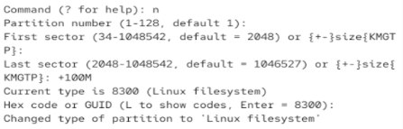{#fig-001 width=70%}

Записываем изменения в таблицу разделов ядра и смотрим информацию о добавленных разделах

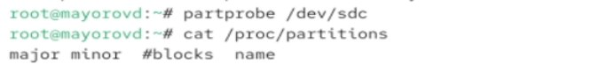{#fig-001 width=70%}

Устанавливаем метку файловой системы в ext4disk. Устанавливаем параметры монтирования по умолчанию для файловой системы

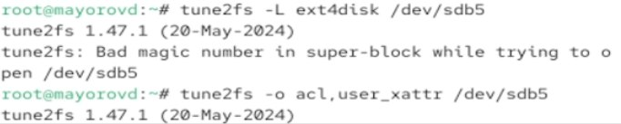{#fig-001 width=70%}

Создаем точку монтирования для раздела. Монтируем файловую систему. Проверяем корректность монтирования раздела

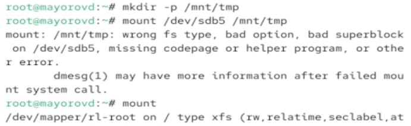{#fig-001 width=70%}

Отмонтируем раздел

{#fig-001 width=70%}

Создаем точку монтировнаия для раздела XFS. Смотрим информацию об идентификаторах блочных устройств

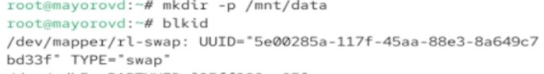{#fig-001 width=70%}

Открываем файл /etc/fstab для редактирования и добавляем нужную нам строку

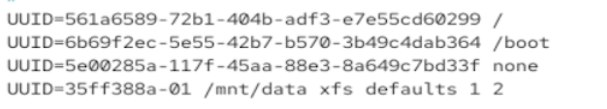{#fig-001 width=70%}

Монтриуем и проверяем что раздел примонтирован правильно

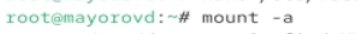{#fig-001 width=70%}

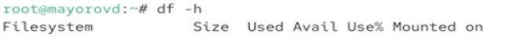{#fig-001 width=70%}

# Выводы

Получены навыки создания разделов на диске и файловых систем. Получить навыки монтирования файловых систем

:::
