---
## Author
author:
  name: Майоров Дмитрий Андреевич

## Title
title: Управление логическими томами

---

# Информация

## Докладчик

:::::::::::::: {.columns align=center}
::: {.column width="70%"}

  * Майоров Дмитрий Андреевич

:::
::: {.column width="30%"}

:::
::::::::::::::

# Цель работы

Получить навыки управления логическими томами

# Выполнение лабораторной работы

Получаем полномочия администратора. Открываем файл /etc/fstab для редактирования. Удаляем строку автомонтирования /mnt/data

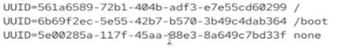{#fig-001 width=70%}

# Выполнение лабораторной работы

Отмонтируем /mnt/data и /mnt/data-ext

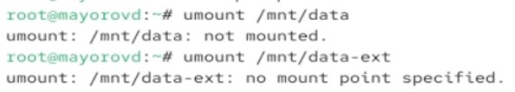{#fig-001 width=70%}

# Выполнение лабораторной работы

Создаем новый виртуальный жесткий диск. Будем работать с ним

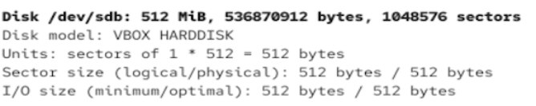{#fig-001 width=70%}

# Выполнение лабораторной работы

Создаем основной раздел с типом LVM

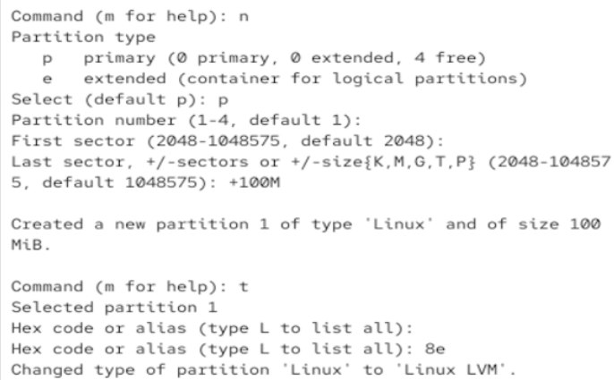{#fig-001 width=70%}

# Выполнение лабораторной работы

Обновляем таблицу разделов. Указываем раздел, как физическим том LVM. Вводим pvs, чтобы убедиться, что физический том создан успешно

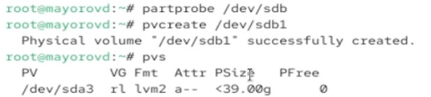{#fig-001 width=70%}

# Выполнение лабораторной работы

Проверяем доступность физических томов в системе

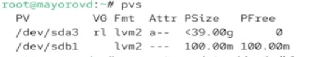{#fig-001 width=70%}

# Выполнение лабораторной работы

СОздаем группу томов с присвоенным ей физическим томом. Убеждаемся, что группа томов была создана успешно

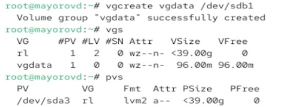{#fig-001 width=70%}

# Выполнение лабораторной работы

Создаем логический том LVM с именем lvdata. Проверяем успешность добавления тома

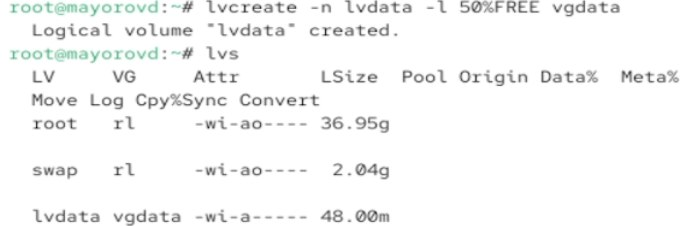{#fig-001 width=70%}

# Выполнение лабораторной работы

Создаем файловую систему поверх логического тома. Далее создаем папку, на которую можно смонтировать том

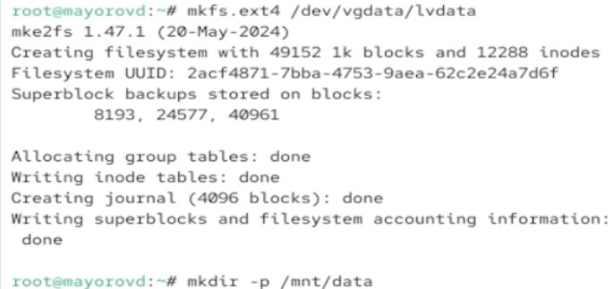{#fig-001 width=70%}

# Выполнение лабораторной работы

Добавляем следующую строку в /etc/fstab

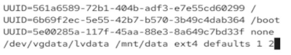{#fig-001 width=70%}

# Выполнение лабораторной работы

Проверяем, монтируется ли файловая система

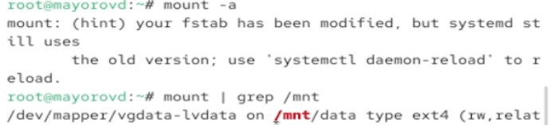{#fig-001 width=70%}

# Выполнение лабораторной работы

Отображаем текущую конфигурацию физических томов и группы томов

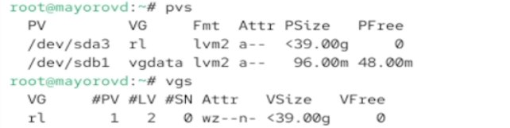{#fig-001 width=70%}

# Выполнение лабораторной работы

С помощью fdisk добавляем раздел /dev/sdb2 размером 100 М. Задаем тип раздела 8e

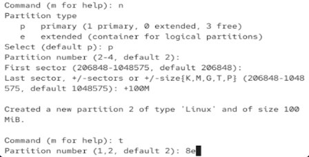{#fig-001 width=70%}

# Выполнение лабораторной работы

Создаем физический том. Расширяем vgdata. Проверяем, что размер доступной группы томов увеличен

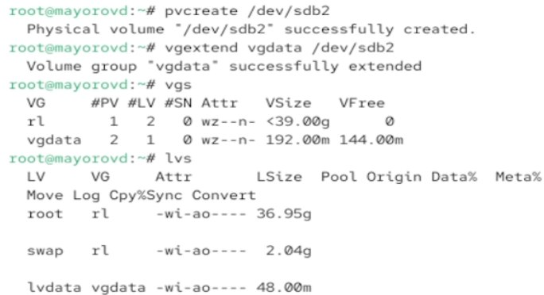{#fig-001 width=70%}

# Выполнение лабораторной работы

Проверяем текущий размер логического тома lvdata

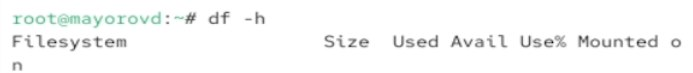{#fig-001 width=70%}

# Выполнение лабораторной работы

Увеличиваем lvdata на 50% оставшегося доступного дискового пространства в группе томов

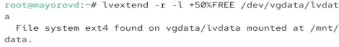{#fig-001 width=70%}

# Выполнение лабораторной работы

Убеждаемся, что добавленное дисковое пространство стало доступным

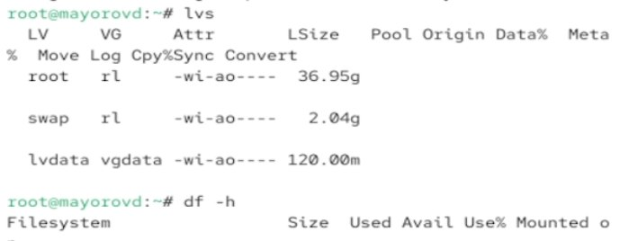{#fig-001 width=70%}

# Выполнение лабораторной работы

Уменьшаем размер lvdata на 50 МБ

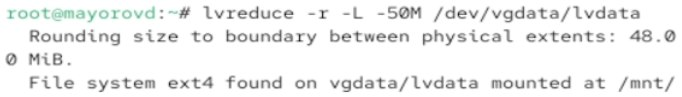{#fig-001 width=70%}

# Выполнение лабораторной работы

Убеждаемся в успешном изменении дискового пространства

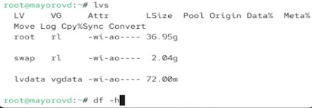{#fig-001 width=70%}

# Выводы

Получены навыки управления логическими томами
