---
## Author
author:
  name: Майоров Дмитрий Андреевич

## Title
title: "Програмный RAID"

---

# Цель работы

Освоить работу с RAID-массивами при помощи утилиты mdadm.

# Выполнение лабораторной работы

Добавляем к нашей виртуальной машине к контроллеру SATA три диска размером 512 MiB

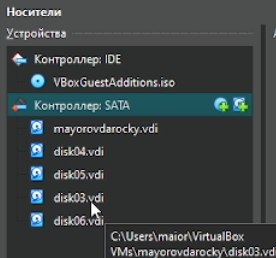{#fig-001 width=70%}

Проверяем наличие созданных нами на предыдущем этапе дисков

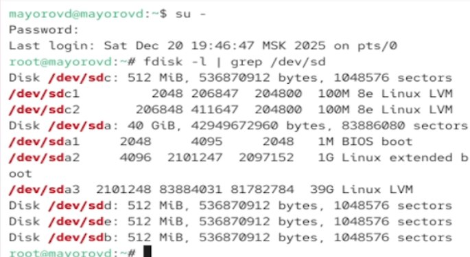{#fig-001 width=70%}

Создаем на каждом из дисков раздел

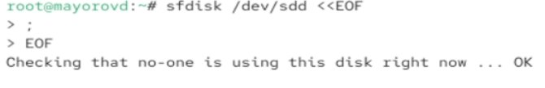{#fig-001 width=70%}

Проверяем текущий тип созданных разделов. Каждый раздел имеет тип 83(Linux)

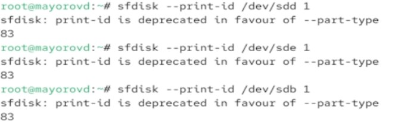{#fig-001 width=70%}

Просмотриваем, какие типы партиций, относящиеся к RAID, можно задать

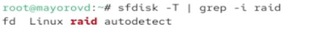{#fig-001 width=70%}

Установливаем тип разделов в Linux raid autodetect

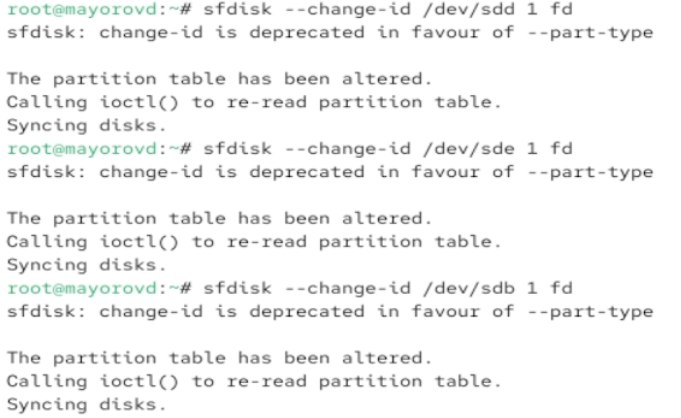{#fig-001 width=70%}

Просмотриваем состояние дисков

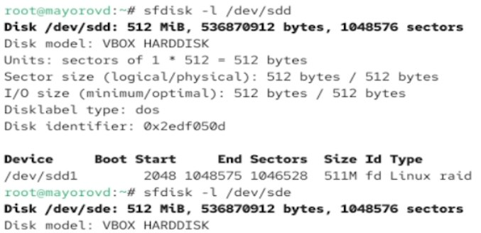{#fig-001 width=70%}

Устанавливаем mdadm

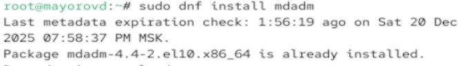{#fig-001 width=70%}

При помощи утилиты mdadm создаем массив RAID 1 из двух дисков

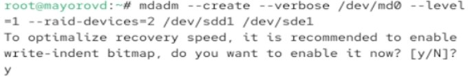{#fig-001 width=70%}

Проверяем состояние массива RAID

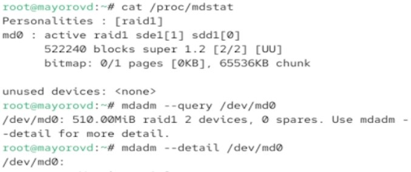{#fig-001 width=70%}

Создаем файловую систему на RAID

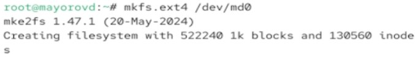{#fig-001 width=70%}

Подмонтировываем RAID

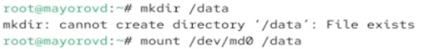{#fig-001 width=70%}

В /etc/fstab для автомонтирования добавляем запись

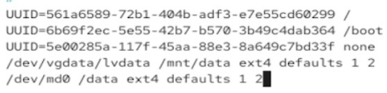{#fig-001 width=70%}

Имитируем сбой одного из дисков. Удаляем сбойный диск и заменяем диск в массиве

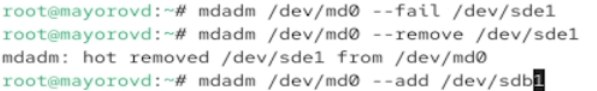{#fig-001 width=70%}

Удаляем массив и очищаем метаданные

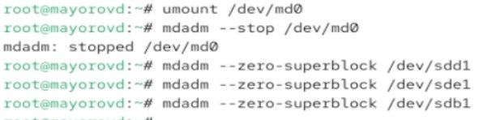{#fig-001 width=70%}

Создаем массив RAID 1 из двух дисков

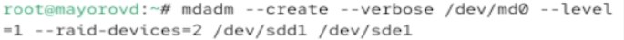{#fig-001 width=70%}

Добавляем третий диск

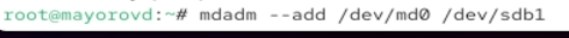{#fig-001 width=70%}

Подмонтировываем /dev/md0

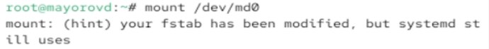{#fig-001 width=70%}

Проверяем состояние массива

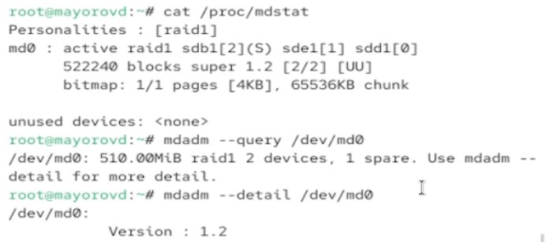{#fig-001 width=70%}

Имитируем сбой одного из дисков. Проверяем состояние массива

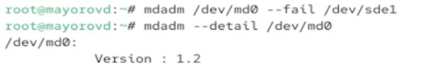{#fig-001 width=70%}

Удаляем массив и очищаем метаданные

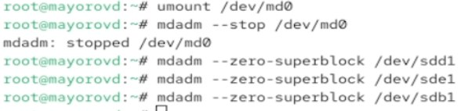{#fig-001 width=70%}

Создаем массив RAID 1 из двух дисков

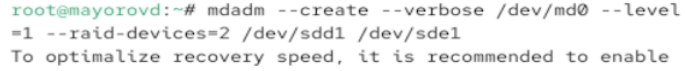{#fig-001 width=70%}

Добавляем третий диск

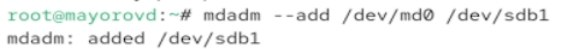{#fig-001 width=70%}

Подмонтировываем /dev/md0

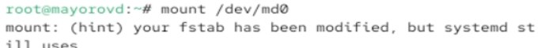{#fig-001 width=70%}

Проверяем состояние массива

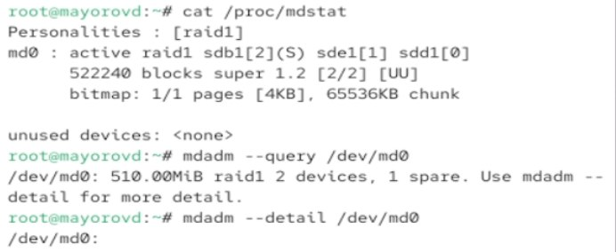{#fig-001 width=70%}

Изменяем тип массива RAID и проверяем состояние массива

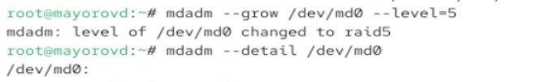{#fig-001 width=70%}

Изменяем количество дисков в массиве RAID 5

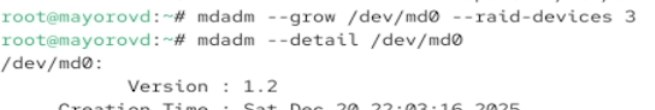{#fig-001 width=70%}

Удаляем массив и очищаем метаданные

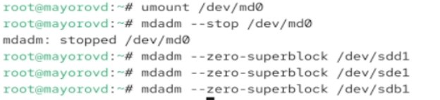{#fig-001 width=70%}

Комментируем запись в /etc/fstab

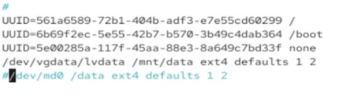{#fig-001 width=70%}

# Выводы

Мы освоили работу с RAID-массивами при помощи утилиты mdadm.

