---
## Author
author:
  name: Майоров Дмитрий Андреевич

## Title
title: "Управление пользователями и группами"
---

# Цель работы

Получение представления о работе с учетными записями пользователей и группами пользователей в опреационной системе типа Linux

# Выполнение лабораторной работы

Определяем какую учетную запись используем, выводим на экран более подробную информацию. uid - ID пользователя и имя. gid - ID основной группы. groups - группы, в которых состоит пользователь.

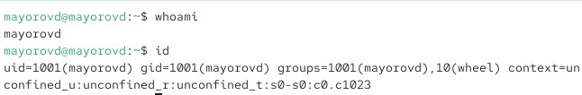{#fig-001 width=70%}

Переключаемся в учетную запись root и выводим на экран более подробную информацию.uid - ID пользователя и имя. gid - ID основной группы. groups - группы, в которых состоит пользователь.

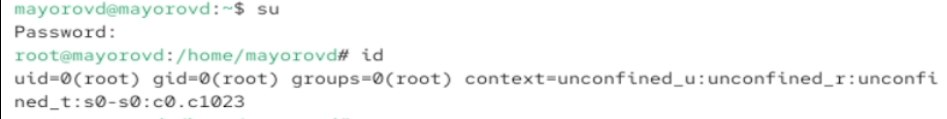{#fig-001 width=70%}

Просматриваем в безопасном режиме файл /etc/sudoers в текстовом редакторе vi. Убеждаемся что в файле есть строка %wheel ALL=(ALL) ALL. Мы используем редактор visudo, т.к. если работать через обычный текстовый редактор, sudo перстанет работать для всех пользователей. Группа wheel - группа админимтраторов Linux.

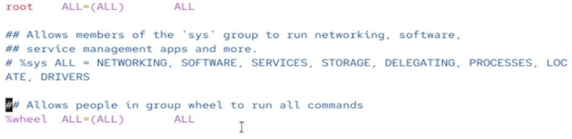{#fig-001 width=70%}

Создаем пользователя alice. Убеждаемся что он добавлен в группу whell. Задаем пароль.

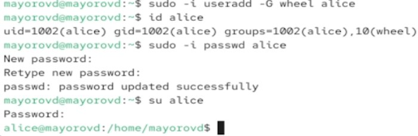{#fig-001 width=70%}

Создаем пользователя bob. Задаем пароль. Смотрим в какие группы входит пользователь.

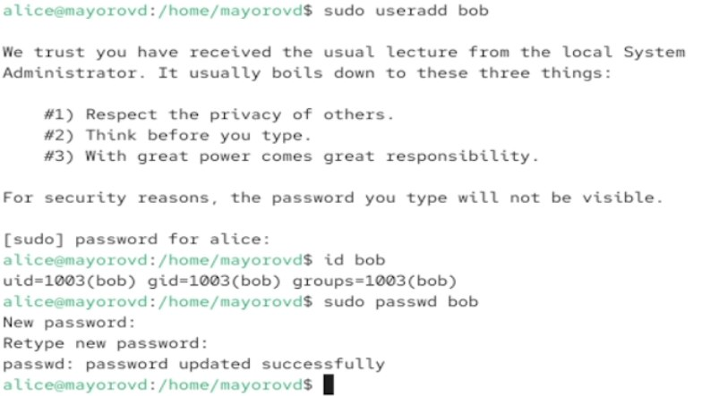{#fig-001 width=70%}

Пернходим в учетную запись root. Открываем файл используя vim.

{#fig-001 width=70%}

Находим параметр CREATE_HOME и убеждаемся что он установлен в значение yes. Также устанавливаем параметр USERGROUPS_ENAB no.

{#fig-001 width=70%}

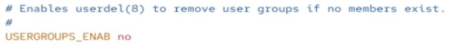{#fig-001 width=70%}

Создаем каталоги Pictures и Documents.

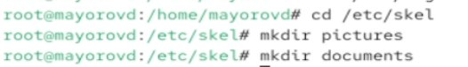{#fig-001 width=70%}

Создаем пользователя Carol. Задаем пароль

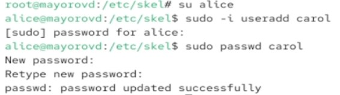{#fig-001 width=70%}

Просмтариваем информацию о Carol. Убеждаемся, что каталоги Pictures и Documents были созданы в домашнем каталоге пользователя Carol.

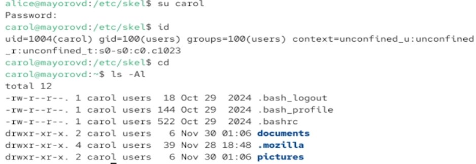{#fig-001 width=70%}

Смотрим строку записи о пароле пользователя CArol. $y$ - алгоритм хеширования. Длинная строка после $y$ - хеш пароля. 20421 - дата с последнего изменения пароля. 0 - минимальное время до следующей смены. 99999 - максимальное время дейсвтия пароля.

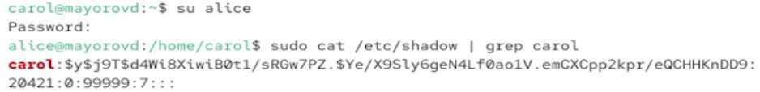{#fig-001 width=70%}

Меняем свойства пароля

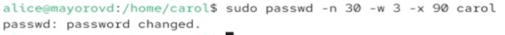{#fig-001 width=70%}

Убеждаемся в изменении в строке с данными о пароле. Убеждаемся, что идентификатор alice существует во всех трех файлах. Убеждаемся, что идентификатор Carol существует не во всех трех файлах.

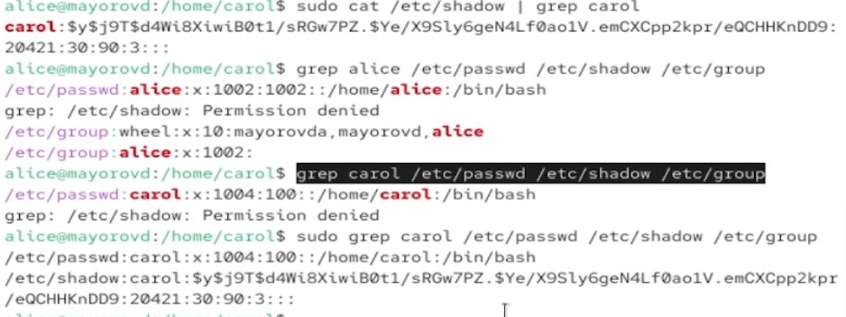{#fig-001 width=70%}

СОздаем группы main и third.

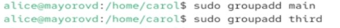{#fig-001 width=70%}

Добавляем пользователей в нужные группы. 

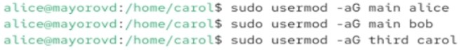{#fig-001 width=70%}

Убеждаемся что пользователь CArol правильно добавлен в группу third. 

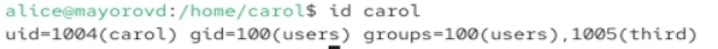{#fig-001 width=70%}

# Выводы

Мы получили представление о работе с учетными записями пользователей и группами пользователей в опреационной системе типа Linux

Здесь кратко описываются итоги проделанной работы.

