---
## Author
author:
  name: Майоров Дмитрий Андреевич

## Title
title: Настройка прав доступа

---

## Докладчик

  * Майоров Дмитрий Андреевич
 

# Цель работы

Получение навыков настройки базовых и специальных прав доступа для групп ползователей в операционной системе Linux.

# Выполнение лабораторной работы

Открываем терминал с учетной записью root. Создаем каталоги /data/main и /data/third. Смотрим кто является владельцем этих каталогов.

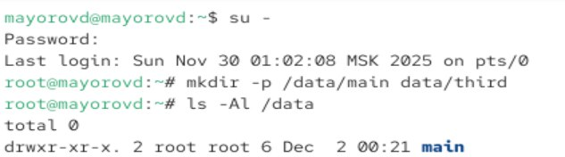{#fig-001 width=70%}

# Выполнение лабораторной работы

Изменяем владельцев с root на main и third. Смотрим кто теперь является владельцем.

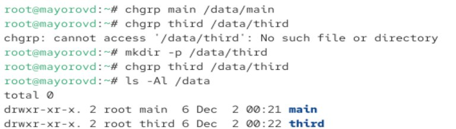{#fig-001 width=70%}

# Выполнение лабораторной работы

Устанавливем разрешения, позволяющие владельцам записывать файлы в эти каталоги и зпрещающие доступ к содержимому всем другим пользователям.

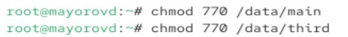{#fig-001 width=70%}

# Выполнение лабораторной работы

Переходим в учетную запись bob. Пробуем перейти в каталог /data/main и создать там файл. Файл создался. Делаем тоже самое в каталоге /data/third. В этом каталоге в доступе отказано

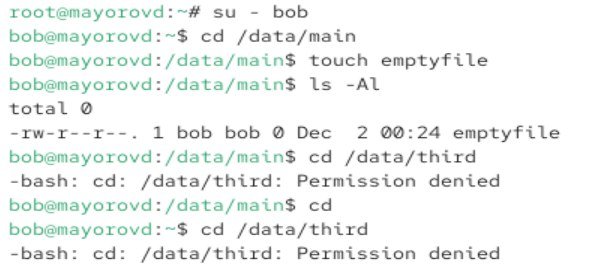{#fig-001 width=70%}

# Выполнение лабораторной работы

Переходим в учетную запись alice. Слздаем два файла в каталоге /data/main.

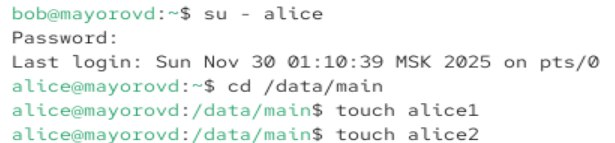{#fig-001 width=70%}

# Выполнение лабораторной работы

Переходим в учетную запись bob. Переходим в каталог /data/main. Пробуем удалить файлы пользователя alice. Файлы удалены.

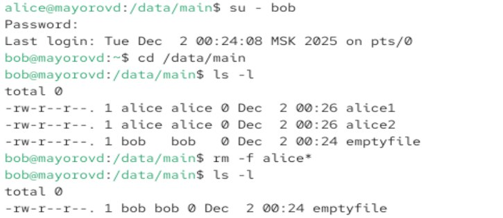{#fig-001 width=70%}

# Выполнение лабораторной работы

Создаем два файла, принадлежащие пользователю bob.

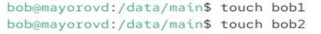{#fig-001 width=70%}

# Выполнение лабораторной работы

Переходим в root. Устанавливаем для каталога /data/main бит идентификатора группы и stiky-бит для общего каталога группы.

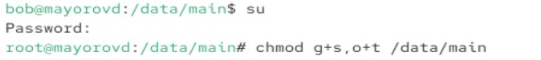{#fig-001 width=70%}

# Выполнение лабораторной работы

Под пользователем alice создаем два файла. Пробуем удалить файлы принадлежащие пользователю bob.

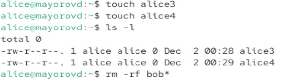{#fig-001 width=70%}

# Выполнение лабораторной работы

Переходим в root. Устанавливаем права на чтение и выполнение в каталоге /data/main для группы third и права на чтение и выполнение для группы main в каталоге /data/third. 

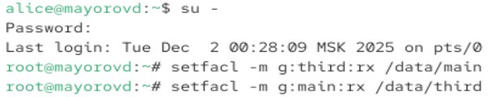{#fig-001 width=70%}

# Выполнение лабораторной работы

Убеждаемся в правильности установки разрешений

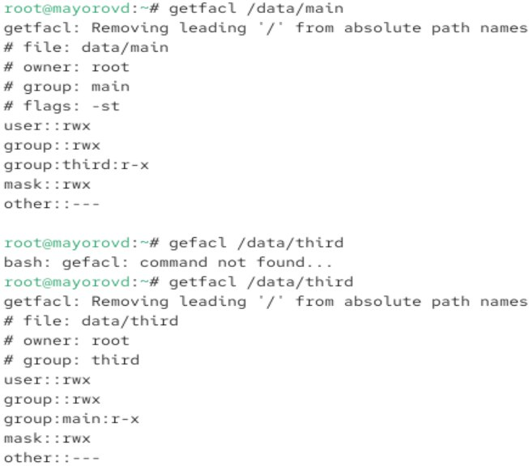{#fig-001 width=70%}

# Выполнение лабораторной работы

Создаем новый файл и используем getfacl для проверки текущих назначений полномочий.

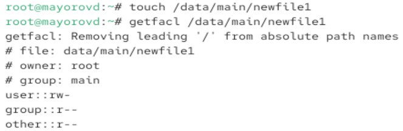{#fig-001 width=70%}

# Выполнение лабораторной работы

Устнавливаем ACL по умолчанию для каталогов

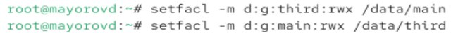{#fig-001 width=70%}

# Выполнение лабораторной работы

Убеждаемся что настройки ACL работают. Проверяем текущие назначения полномочий в каталоге /data/main

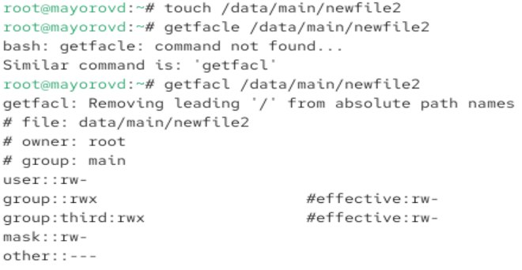{#fig-001 width=70%}

# Выполнение лабораторной работы

Делаем те же действия для каталога data/third

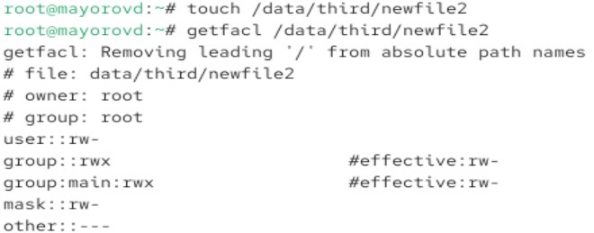{#fig-001 width=70%}

# Выполнение лабораторной работы

Переходим в carol. Проверяем операции с файлами и проверяем возможно ли осуществить запись в файл.

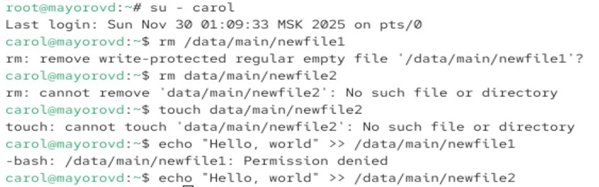{#fig-001 width=70%}

# Выводы

Мы получили навыки настройки базовых и специальных прав доступа для групп ползователей в операционной системе Linux.

:::
