---
## Author
author:
  name: Майоров Дмитрий Андреевич

## Title
title: "Работа с програмными пакетами"

---

# Цель работы

Получить навыки работы с репозиториями и менеджерами пакетов

# Выполнение лабораторной работы

Переходим в режим суперпользователя. Переходим в каталог /etc/yum.repos.d и изучаем содержание каталога и файлов репозиториев 

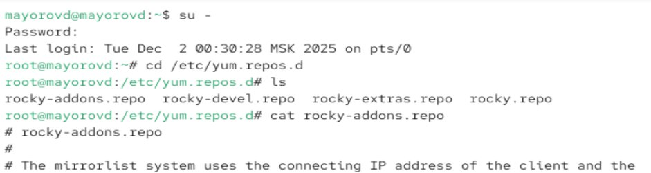{#fig-001 width=70%}

Выводим на экран список репозиториев и список пакетов, в названии или описании которых есть слово user.

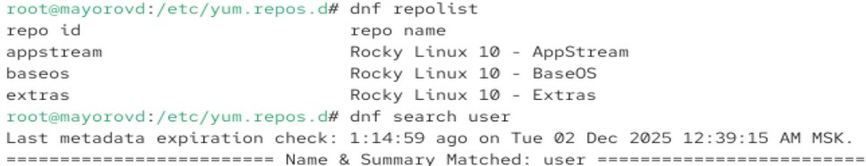{#fig-001 width=70%}

Устанавливаем nmap, предварительно изучив информацию по имеющимся пакетам

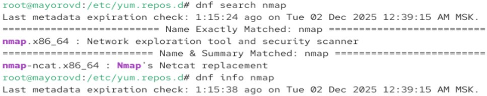{#fig-001 width=70%}

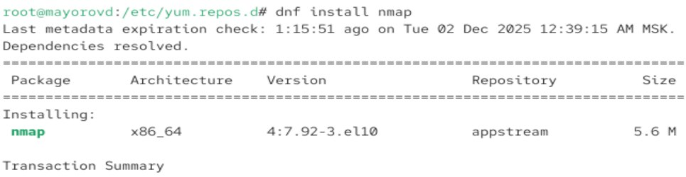{#fig-001 width=70%}

Удаляем nmap

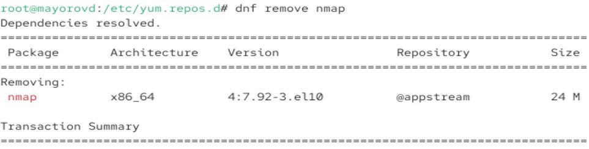{#fig-001 width=70%}

Получаем список имеющихся групп пакетов, затем устанавливаем группу пакетов RPM Development Tools

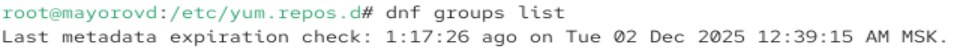{#fig-001 width=70%}
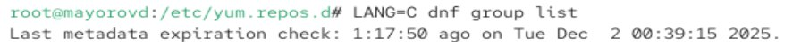{#fig-001 width=70%}
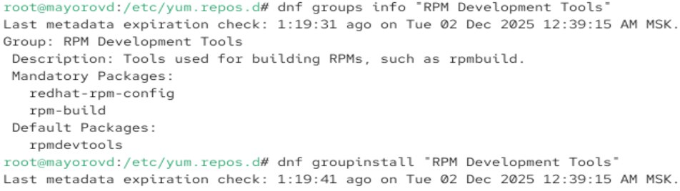{#fig-001 width=70%}

Удаляем группу пакетов

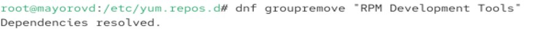{#fig-001 width=70%}

Смотрим историю использования dnf и отменяем пятое по счету действие

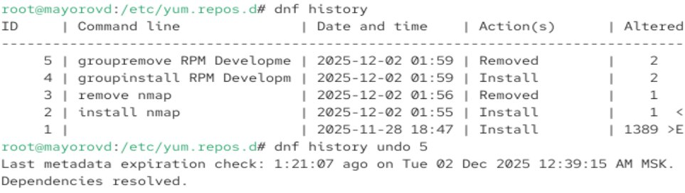{#fig-001 width=70%}

Скачиваем rpm-пакет lynx

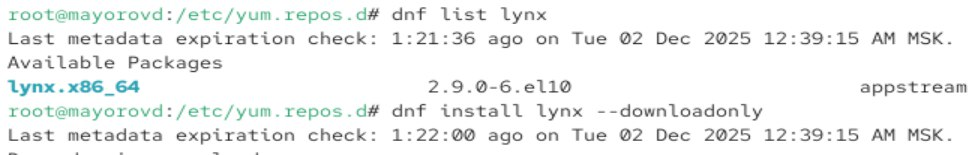{#fig-001 width=70%}

Находим каталог куда он был помещен после загрузки, переходим туда и устанавливаем rpm-пакет.

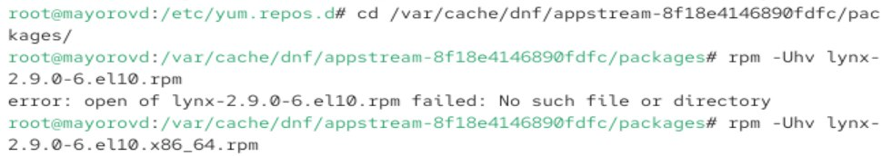{#fig-001 width=70%}

Определяем расположение исполняемого файла, определяем, к каокму пакету принадлежит lynx, получаем дополнительную информацию. Получаем список всех файлов в пакете, выводим перечень файлов с документацией пакета. Выводим перечень и расположение конфигурационных файлов и расположение и содержание скриптов. Далее удаляем пакет.

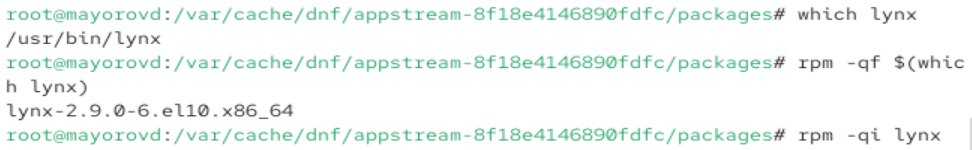{#fig-001 width=70%}
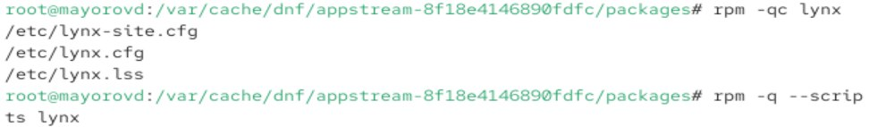{#fig-001 width=70%}

Устанавливаем пакет dnsmasq

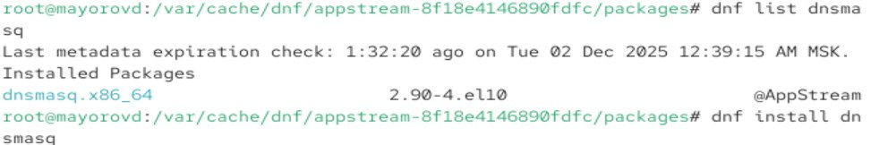{#fig-001 width=70%}

Определяем расположение исполняемого файла, определяем, к каокму пакету принадлежит dnsmasq, получаем дополнительную информацию. Получаем список всех файлов в пакете, выводим перечень файлов с документацией пакета. Выводим перечень и расположение конфигурационных файлов и расположение и содержание скриптов. Далее удаляем пакет.

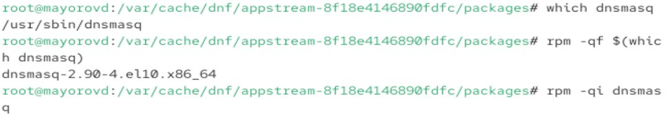{#fig-001 width=70%}
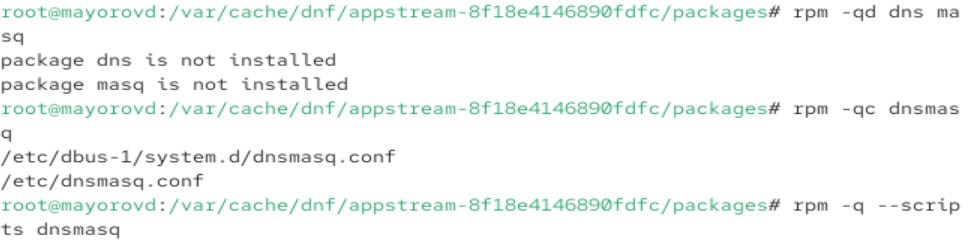{#fig-001 width=70%}

# Выводы

Мы получили навыки работы с репозиториями и менеджерами пакетов

:::
