---
## Author
author:
  name: Майоров Дмитрий Андреевич

## Title
title: "Управление системными службами"

---

# Цель работы

Получить навыки управления системными службами операционной системы посредством systemd

# Выполнение лабораторной работы

Получаем полномочия администратора. Проверяем статус службы Very Secure FTP.(сервис в настоящее время отключен) Устанаваливаем данную службу

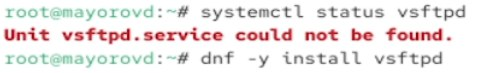{#fig-001 width=70%}

Запускаем службу и проверяем ее статус. Служба в настоящее время работает, но не будет активирована при перезапуске операционной системы.

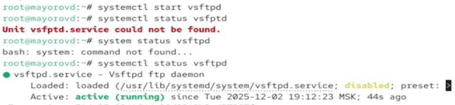{#fig-001 width=70%}

Добавляем службу в автозапуск, проверяем ее статус, затем удаляем из автозапуска.

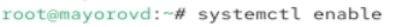{#fig-001 width=70%}

Выводим на экран символические ссылки и снова добавляем службу в автозапуск

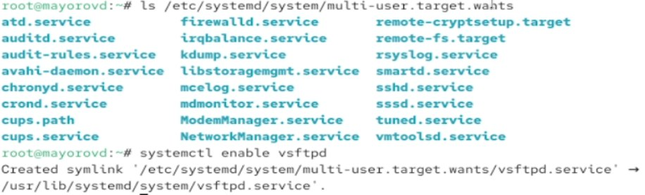{#fig-001 width=70%}

Снова проверяем статус службы

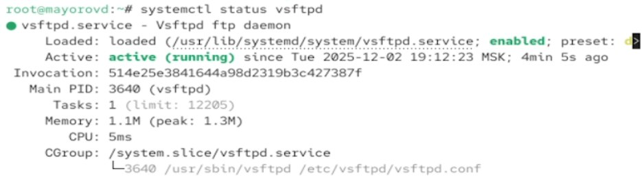{#fig-001 width=70%}

Выводим на экарн список зависимостей юнита

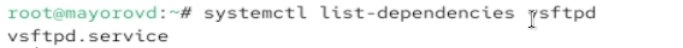{#fig-001 width=70%}

Устанавливаем iptables. Проверяем статус firewalld и iptables

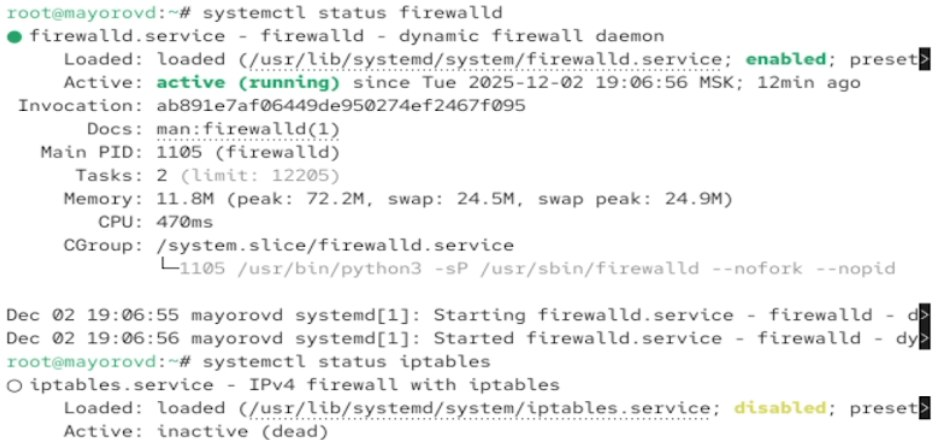{#fig-001 width=70%}

Пробуем запустить firewalld и iptables

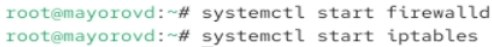{#fig-001 width=70%}

Выгружаем iptables и загружаем firewalld. Блокируем запуск iptables.

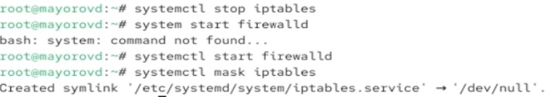{#fig-001 width=70%}

Пробуем запустить iptables и добавить его в автозапуск. Сервис неактивен, а статус загрузки отображается как замаскированный 

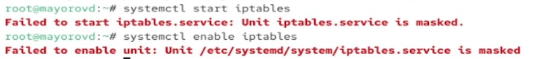{#fig-001 width=70%}

Получаем список всех активных загруженных целей.

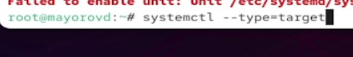{#fig-001 width=70%}

Переходим в каталог systemd и находим список всех целей, которые можно изолировать.

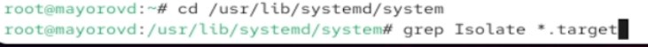{#fig-001 width=70%}

Переключаем ОС в режим восстановления и перезапускаем ее

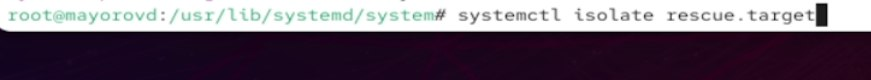{#fig-001 width=70%}

Выводим на экран цель, установленную по умолчанию. Устаанваливаем текстовый режим по умолчанию. Перезагружаем систему

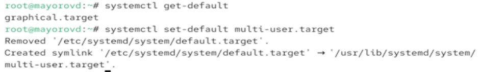{#fig-001 width=70%}

Устанаваливаем графический режим по умолчанию и перезапускаем систему

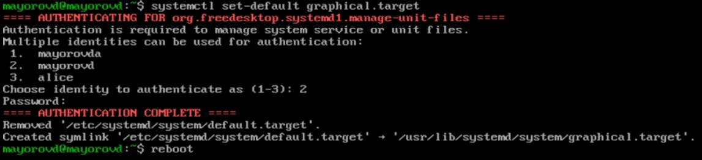{#fig-001 width=70%}

# Выводы

Мы получили навыки управления системными службами операционной системы посредством systemd
