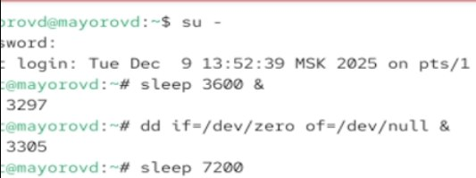
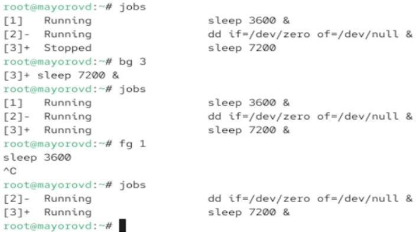
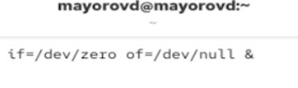
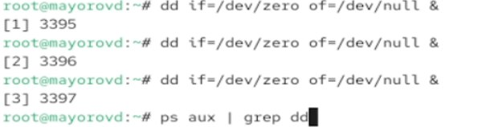
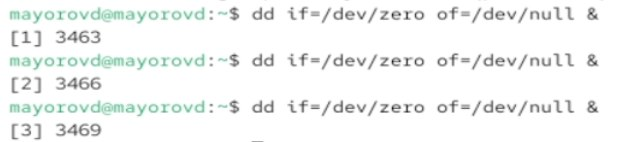
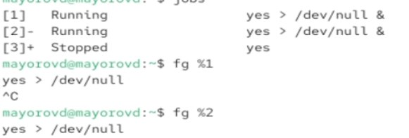
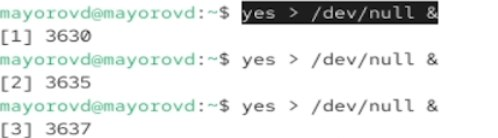

---
## Author
author:
  name: Майоров Дмитрий Андреевич

## Title
title: "Управление процессами"

---

# Цель работы

Получение навыков управления процессами операционной системы.

# Выполнение лабораторной работы

Получаем полномочия админимтратора. Вводим нужные команды

{#fig-001 width=70%}

Вводим команду jobs. Видим три запущенныз задания. Первые два имеют состояние Running, а последнее задание в настоящее время находится в состоянии  Stopped. ПЕреводим задание 3 в фоновый режим. Перемещаем задание 1 на передний план. Отменяем его. Делаем тоже самое для заданий 2 и 3.

{#fig-001 width=70%}

Открываем второй треминал и вводим там dd if=/dev/zero of=/dev/null &. Выходим из терминала

{#fig-001 width=70%}

Запускаем 3 процесса. Используем ps aux | grep dd для просмотра всех строк где есть буквы dd.

{#fig-001 width=70%}

Изменяем приоритет одного из процессов

{#fig-001 width=70%}

Запускаем 3 фоновых процесса.

{#fig-001 width=70%}

Увеличиваем приоритет одного из процессов на значение -5. Изменяем еще раз на значение 15. Разница в том, что -5 получает больше CPU. 

{#fig-001 width=70%}
{#fig-001 width=70%}

Завершаем все процессы

{#fig-001 width=70%}

Запускаем программу yes

{#fig-001 width=70%}

Переводим процесс на передний план. Потом переводим в фоновый режим. Проверяем состояние заданий командой jobs.

{#fig-001 width=70%}

Запускаем процесс в фоновом режиме так, чтобы он работал даже после отключения терминала.

{#fig-001 width=70%}

Запускаем еще три программы yes

{#fig-001 width=70%}

Убиваем два процесса используя PID и идентификатор

{#fig-001 width=70%}

Завершаем их работу одновременно испольхуя killall

{#fig-001 width=70%}

# Выводы

Мы получили навыки управления процессами операционной системы.

