---
## Author
author:
  name: Майоров Дмитрий Андреевич

## Title
title: "Управление журналами событий в системе"

---

# Цель работы

Получить навыки работы с журналами мониторинга различных событий в системе

# Выполнение лабораторной работы

Открываем три вкладки терминала и в каждом из них получаем полномочия администратора

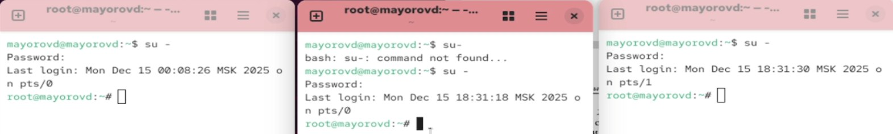{#fig-001 width=70%}

Во второй вкладке терминала запускаем мониторинг системных чобытий в реальном времени

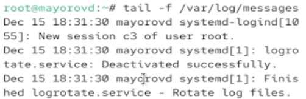{#fig-001 width=70%}

В третьей вкладке терминала возвращаемся к учетной записи своего пользователя и пробуем получить права администратора, но вводим неверный пароль. В мониторинге событий получаем сообщение "FAILED SU (to root) mayorovda"

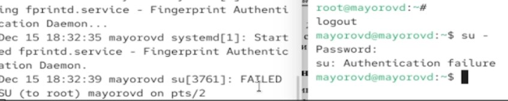{#fig-001 width=70%}

В третьей вкладке терминала вводим logger hello. В мониторинге событий видим сообщение "hello"

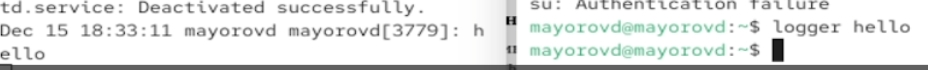{#fig-001 width=70%}

С помощью ctrl+c останавливаем трассировку файла сообщений мониторинга в реальном времени и запускаем мониторинг сообщений безопастности

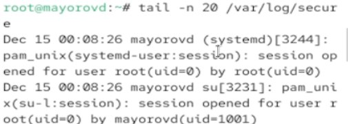{#fig-001 width=70%}

Устанавливаем Apache

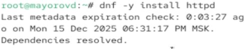{#fig-001 width=70%}

Запускаем веб службу

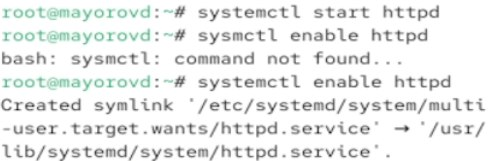{#fig-001 width=70%}

Во второй вкладке терминала смотрим журнал сообщений об ошибках веб-службы

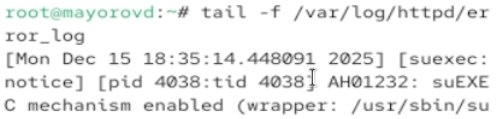{#fig-001 width=70%}

В третьей вкладке терминала получаем полномочия администратора и в файле конфигурации /etc/httpd/conf/httpd.conf в конце добавляем следующую строку: ErrorLog syslog:local1

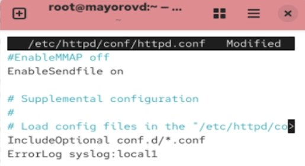{#fig-001 width=70%}

Переходим в каталог etc/rsyslog.d и создаем там файл мониторинга событий веб-службы

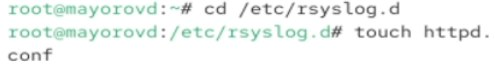{#fig-001 width=70%}

Открываем файл на редактирование и прописываем в нем local1.* -/var/log/httpd-error.log.

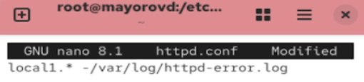{#fig-001 width=70%}

В первой вкладке терминала перезагружаем веб-службу и конфигурацию rsyslogd

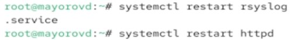{#fig-001 width=70%}

В третьей вкладке терминала создаем файл конфигурации для мониторинга отладочной информации и вводим следующую команду

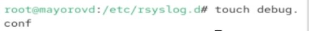{#fig-001 width=70%}

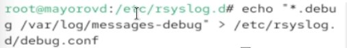{#fig-001 width=70%}

В первой вкладке терминала перезагружаем rsylogd

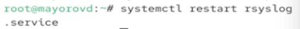{#fig-001 width=70%}

Во второй вкладке терминала запускаем мониторинг отладочной информации

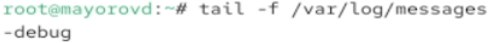{#fig-001 width=70%}

В третьей вкладке терминала вводим следующую команду. Смотрим в мониторинге сообщение отладки. Закрываем трассировку с помощью ctrl+c

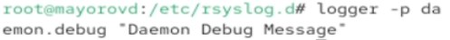{#fig-001 width=70%}

Во второй вкладке терминала используем journalctl для просмотра журнала содержимого с событиями с момента послднего запуска системы

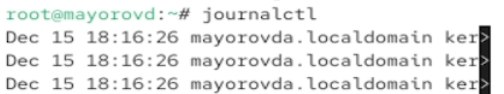{#fig-001 width=70%}

Используем --no-pager для просмотра журанала без пейджера и -f для просмотра журнала в реальном времени

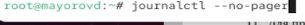{#fig-001 width=70%}

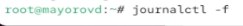{#fig-001 width=70%}

Смотрим события для UID0, последние 20 строк журнала и сообщения об ошибках

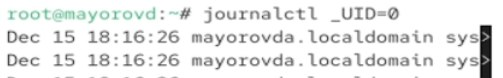{#fig-001 width=70%}

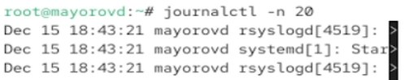{#fig-001 width=70%}

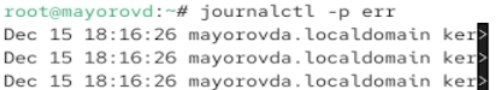{#fig-001 width=70%}

Просматриваем все сообщения со вчерашнего дня и сообщения с ошибкой приоритета со вчерашнего дня

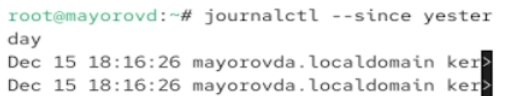{#fig-001 width=70%}

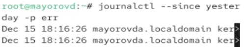{#fig-001 width=70%}

Просмтариваем детальную информацию и дополнительную информацию о модуле sshd

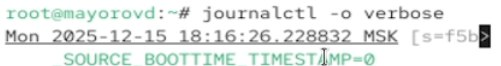{#fig-001 width=70%}

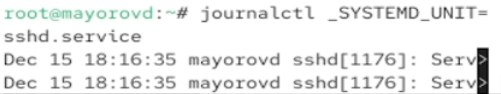{#fig-001 width=70%}

Запускаем новый терминал и получаем полномочия администратора. Создаем каталог для хранения записей журнала

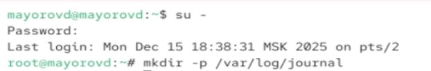{#fig-001 width=70%}

Скорректируем права доступа для каталога /var/log/journal, чтобы journald смог записывать в него информацию

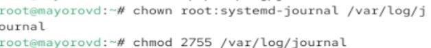{#fig-001 width=70%}

Принимаем изменения используя следующую команду

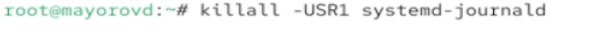{#fig-001 width=70%}

Просмтариваем сообщения журнала с момента последней перезагрузки

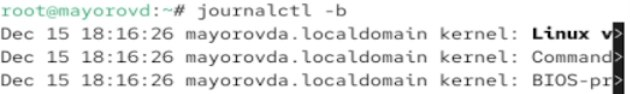{#fig-001 width=70%}

# Выводы

Мы получили навыки работы с журналами мониторинга различных событий в системе
:::
