---
## Author
author:
  name: Майоров Дмитрий Андреевич

## Title
title: "Планировщики событий"

---

# Цель работы

Получение навыков работы с планировщиками событий cron и at.

# Выполнение лабораторной работы

Запускаем терминал и получаем полномочия администратора.

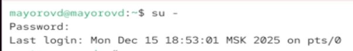{#fig-001 width=70%}

Смотрим статус демона crond

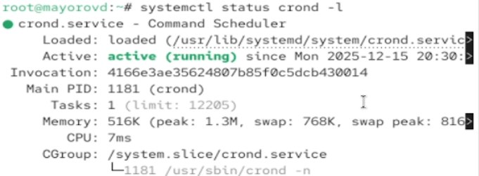{#fig-001 width=70%}

Смотрим содержимое файла конфигурации /etc/crontab

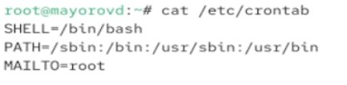{#fig-001 width=70%}

Смотрим список заданий в расписании. Ничего не отображается, так как расписание еще не задано

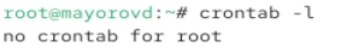{#fig-001 width=70%}

Открываем файл расписание на редактирование. Добавляем следующую строку в файл распсиания. В этой команде "*/1" обозночает, что команда logger будет выполняться каждую минуту. Звездочки обозначают, что командла будет выполняться каждый час, день месяца, месяц и день недели

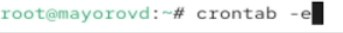{#fig-001 width=70%}

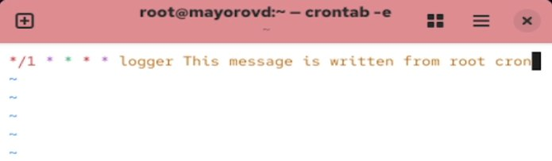{#fig-001 width=70%}

Еще раз смотрим список заданий в расписании. Появилась запись о запланированном событии

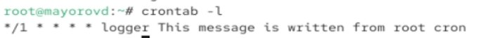{#fig-001 width=70%}

Через 2 минуты просматриваем журнал системных событий. Запись, добавленная в команду logger корректно записывает сообщения в системный журнал каждую минуту

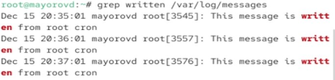{#fig-001 width=70%}

Изменяем запись в расписании crontab. Здесь "0" обозночает, что команда выполянется в нулевую минуту часа. "*/1" обозначает, что команда выполянется каждый час. Звездочки обозначают, что команда выполняется в лююой день меясца и в любой месяц. "1-5" обозначает, что команда выполняется с понедельика по пятницу.

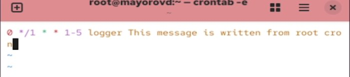{#fig-001 width=70%}

Смотрим список заданий в расписании. Задание изменилось

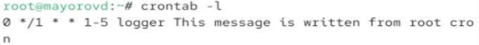{#fig-001 width=70%}

Переходим в каталог /etc/cron.hourly. Создаем там файл сценария

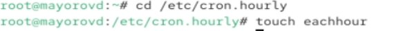{#fig-001 width=70%}

Открываем файл для редактирования и прописываем в нем следующий скрипт(запись сообщения в системный журнал)

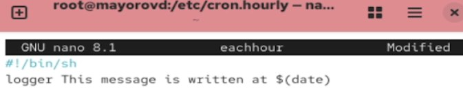{#fig-001 width=70%}

Делаем файл сценария eachour исполняемым

{#fig-001 width=70%}

Переходим в каталог /etc/crond.d. Создаем там файл с расписанием

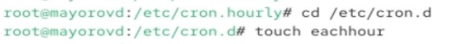{#fig-001 width=70%}

Открываем этот файл для редактирования и прописываем туда следующую строку. Здесь "11" означает, что команда выполянется в 11-ю минуту часа. Звездочки означают, что команда выполняется каждый час, день месяца, месяц, день недели. "root" означает что команда будет выполняться от имени пользователя root.

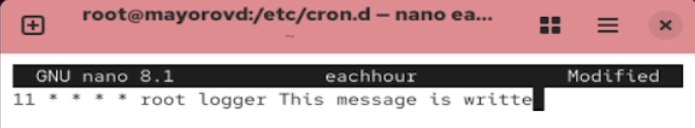{#fig-001 width=70%}

Ждем 3 часа. Просмтариваем журнал системных событий. Запуск сценаия eachhour был осуществлен в соотвествии с заданеым расписанием

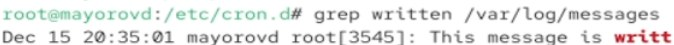{#fig-001 width=70%}

Запускаем новый терминал. Получаем полномочия администратора. Проверяем, что служба atd  загружена и включена

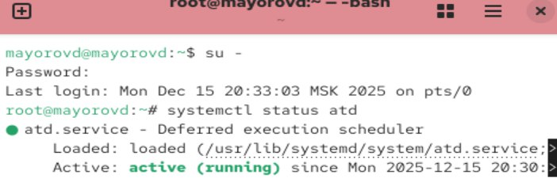{#fig-001 width=70%}

Задаем выполнение команды logger message from at на нужное нам время. Закрываем оболочку с помощью ctrl+d.

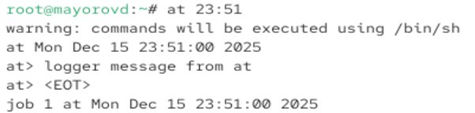{#fig-001 width=70%}

Убеждаемся, что задание действительно запланировано

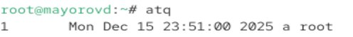{#fig-001 width=70%}

Смотрим, появилось ли в лог-файле соответсвующее сообщение в указанное нами время. Да, появилось

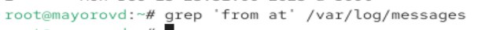{#fig-001 width=70%}

# Выводы

Мы получили навыки работы с планировщиками событий cron и at.
