---
## Author
author:
  name: Майоров Дмитрий Андреевич

title: Управление SELinux

---

# Информация

## Докладчик

:::::::::::::: {.columns align=center}
::: {.column width="70%"}

  * Майоров Дмитрий Андреевич

:::
::: {.column width="30%"}

:::
::::::::::::::

# Цель работы

Получить навыки работы с контекстом безопасности и политиками SELinux.

# Выполнение лабораторной работы

Получаем полномочия админимтратора. Смотрим текущцю информацию о состоянии SELinux. SELinux включен(enabled). Режим работы: принудительный(enforcing). После перезагрузки останется в принудительном режиме. Загружена политика targted. Включена поддержка MLS. Проверка защиты памяти активна. Максимальная версия политики, которую поддерживает ядро.

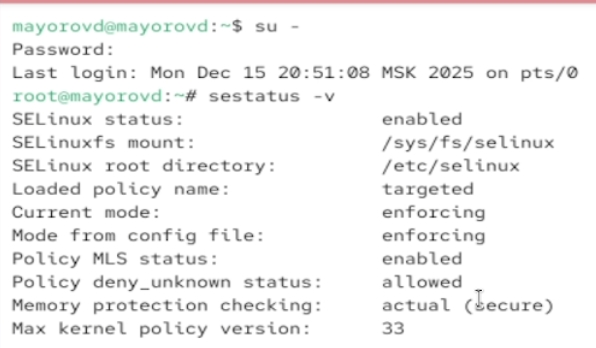{#fig-001 width=70%}

# Выполнение лабораторной работы

Смотрим в каком режиме работает SELinux.(Работает в режиме Enforcing). Изменяем режим работы на разрежающий(permissive). И снова смотрим в каком режиме работает SELinux сейчас.

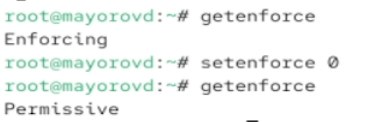{#fig-001 width=70%}

# Выполнение лабораторной работы

В файле  /etc/sysconfig/selinux с помощью редактора устанавливаем SELINUX=disabled. Перезагружаем систему

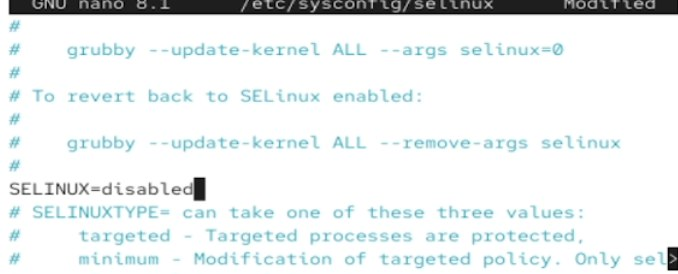{#fig-001 width=70%}

# Выполнение лабораторной работы

После перезагрузки смотрим статус SELinux. Видим что он отключен. Пробуем переключить режим его работы. Система выдает ошибку, так так SELinux сейчас отключен

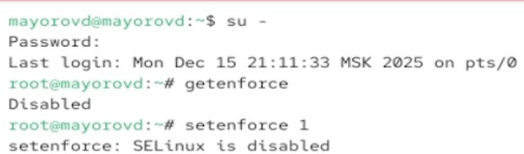{#fig-001 width=70%}

# Выполнение лабораторной работы

Снова открываем файл с помощью редактора и устанавливаем SELINUX=enforcing. Перезагружаем систему

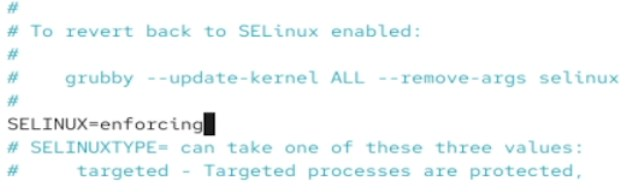{#fig-001 width=70%}

# Выполнение лабораторной работы

После перезагрузки смотрим текущую информацию о состоянии SELinux. Убеждаемся в том, что система работает в принудительном режиме

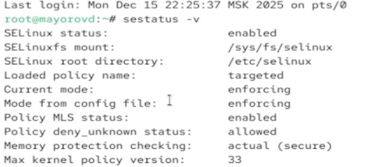{#fig-001 width=70%}

# Выполнение лабораторной работы

Смотрим контекст безопастности файла /etc/hosts. Видим что у файла есть метка контекста net_conf_t. Копируем файл в домашний каталог. Проверяем контекст файла. Видим, что параметр контекста изменился на admin_home_t, так как копирование считается созданием нового файла

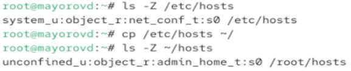{#fig-001 width=70%}

# Выполнение лабораторной работы

Пытаемся перезаписать существующий файл из домашнего каталога в каталог /etc. Убеждаемся что тип контекста все еще admin_home_t. Исправляем контекст безопастности. Убеждаемся что тип контекста изменился

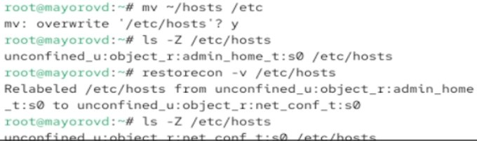{#fig-001 width=70%}

# Выполнение лабораторной работы

Вводим следующую команду для массового исправления контекста безопастности в файловой системе

{#fig-001 width=70%}

# Выполнение лабораторной работы

Устанавливаем необходимое ПО (httpd уже установлен)

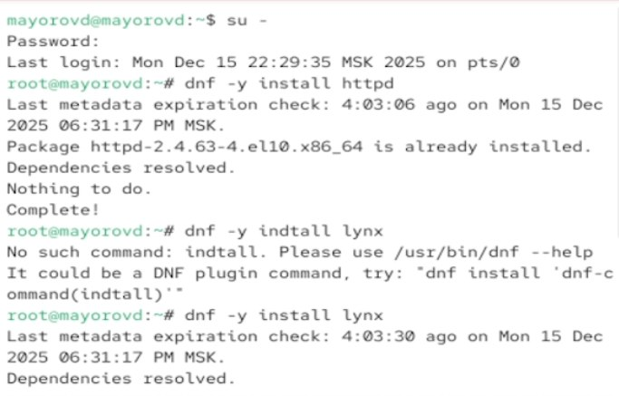{#fig-001 width=70%}

# Выполнение лабораторной работы

Создаем новое хранилище для файлов web-сервера. Переходим в него и создаем файл  index.html.\

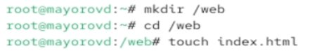{#fig-001 width=70%}

# Выполнение лабораторной работы

Помещаем в файл следующий текст

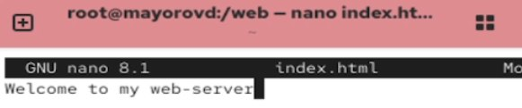{#fig-001 width=70%}

# Выполнение лабораторной работы

В файле /etc/httpd/conf/httpd.conf комментируем строку DocumentRoot "/var/www/html" и ниже добавляем строку DocumentRoot "/web"

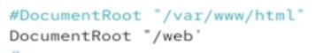{#fig-001 width=70%}

# Выполнение лабораторной работы

Ниже в этом файле комментируем раздел и добавляем другой

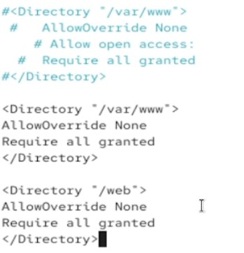{#fig-001 width=70%}

# Выполнение лабораторной работы

Запускаем web-сервер и службу httpd

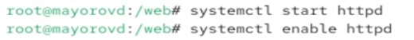{#fig-001 width=70%}

# Выполнение лабораторной работы

Обращаемся к web-серверу в текстовом браузере

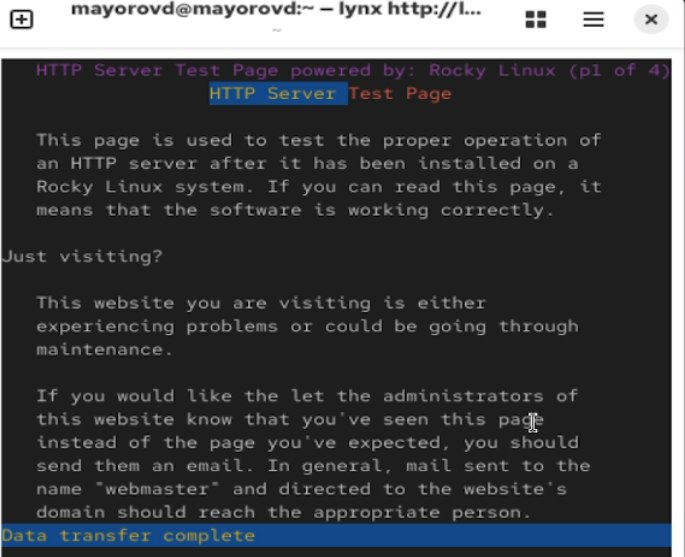{#fig-001 width=70%}

# Выполнение лабораторной работы

Применяем новую метку контекста к /web

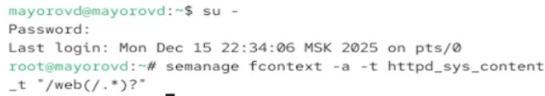{#fig-001 width=70%}

# Выполнение лабораторной работы

Восстанавливаем конекст безопастности

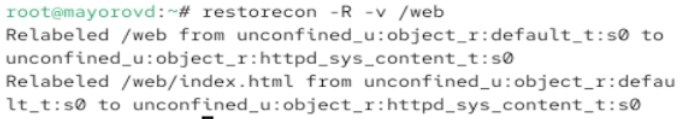{#fig-001 width=70%}

# Выполнение лабораторной работы

Снова обращаемся к web-серверу

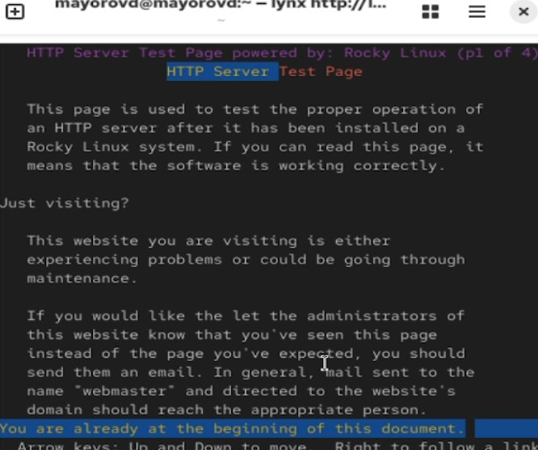{#fig-001 width=70%}

# Выполнение лабораторной работы

Смотрим список переключатеелей SELinux для службы ftp.

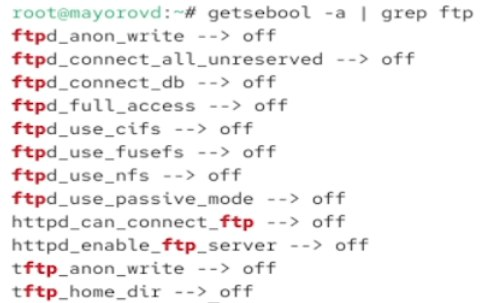{#fig-001 width=70%}

# Выполнение лабораторной работы

Для службы ftpd_anon смотрим список переключателей с пояснением, за что отвечает каждый переключатель, включён он или выключен

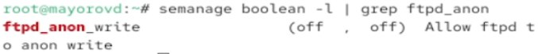{#fig-001 width=70%}

# Выполнение лабораторной работы

Изменяем текущее значение с off на on. Повторно смотрим список переключателей

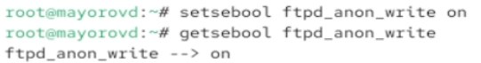{#fig-001 width=70%}

# Выполнение лабораторной работы

Смотрим список переключатеелй с пояснением. Изменяем постоянное значение переключателя с off на on. Снова смотрим список переключателей. Переключатель в состоянии on.

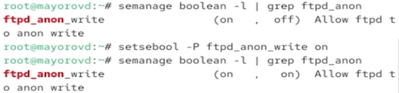{#fig-001 width=70%}

# Выводы

